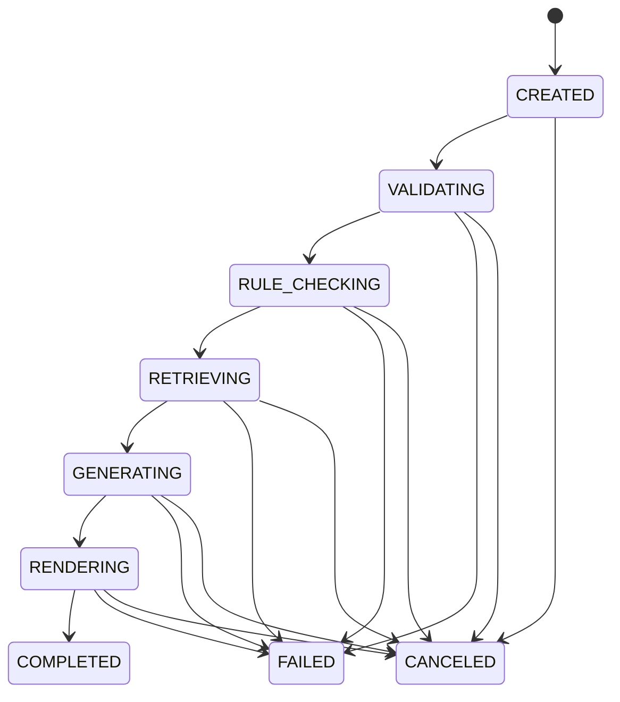

# AI4Law v2 接口设计（v0）

## 1. 设计目标
为 `2.2 / 2.3 / 3.2 / 3.3 / 3.4 / 4.1 / 4.2` 提供统一 API 规范，支持：
1. 表单与附件统一提交
2. 异步任务执行与状态追踪
3. 报告文件下载与审计追溯

## 2. 统一约定

### 2.1 Base URL
- `/api/v0`

### 2.2 通用响应格式
```json
{
  "code": 0,
  "message": "ok",
  "data": {}
}
```

### 2.3 错误码（建议）
- `1001` 参数校验失败
- `1002` 附件缺失/格式不支持
- `1003` 规则校验失败
- `1004` 知识检索失败
- `1005` 渲染失败
- `1006` 任务不存在

## 3. 核心实体

### 3.1 Submission（提交）
```json
{
  "module_code": "2.2",
  "session_id": "sess_xxx",
  "input_payload": {},
  "attachments": [
    {"file_id": "f_xxx", "file_name": "xxx.docx", "mime": "application/vnd.openxmlformats-officedocument.wordprocessingml.document"}
  ],
  "created_by": "user_xxx"
}
```

### 3.2 Task（异步任务）
```json
{
  "task_id": "task_xxx",
  "module_code": "2.2",
  "status": "QUEUED",
  "progress": 0,
  "stage": "validate_input",
  "error": null
}
```

### 3.3 Artifact（输出文件）
```json
{
  "artifact_id": "art_xxx",
  "task_id": "task_xxx",
  "file_name": "示例科技_数据出境风险自评估报告_草案_20260402.docx",
  "file_type": "docx",
  "download_url": "/api/v0/artifacts/art_xxx/download"
}
```

## 4. 任务状态机



状态含义：
1. `VALIDATING`：按 schema 与附件规则校验
2. `RULE_CHECKING`：路径分流与风险逻辑检查
3. `RETRIEVING`：RAG 检索法规/案例/模板上下文
4. `GENERATING`：LLM 输出结构化章节草稿
5. `RENDERING`：渲染 docx/pdf/xlsx/zip

## 5. API 清单

### 5.1 文件上传
- `POST /files/upload`
- 入参：`multipart/form-data`
- 出参：
```json
{
  "code": 0,
  "message": "ok",
  "data": {
    "file_id": "f_xxx",
    "file_name": "合同.docx",
    "mime": "application/vnd.openxmlformats-officedocument.wordprocessingml.document",
    "size": 102400
  }
}
```

### 5.2 创建任务（统一入口）
- `POST /tasks`
- 入参：
```json
{
  "module_code": "2.2",
  "session_id": "sess_xxx",
  "input_payload": {},
  "attachment_ids": ["f_1", "f_2"]
}
```
- 出参：
```json
{
  "code": 0,
  "message": "ok",
  "data": {
    "task_id": "task_xxx",
    "status": "CREATED"
  }
}
```

### 5.3 查询任务状态
- `GET /tasks/{task_id}`
- 出参：
```json
{
  "code": 0,
  "message": "ok",
  "data": {
    "task_id": "task_xxx",
    "module_code": "2.2",
    "status": "GENERATING",
    "progress": 72,
    "stage": "generate_sections",
    "error": null
  }
}
```

### 5.4 取消任务
- `POST /tasks/{task_id}/cancel`

### 5.5 获取任务输出文件列表
- `GET /tasks/{task_id}/artifacts`

### 5.6 下载输出文件
- `GET /artifacts/{artifact_id}/download`

### 5.7 获取审计记录
- `GET /tasks/{task_id}/audit`
- 返回：规则命中、检索来源、模型版本、渲染模板版本

## 6. 模块接口映射（v0）

| 模块 | module_code | 输入字段基线 | 主要输出 |
|---|---|---|---|
| 2.2 安全评估 | `2.2` | `schemas/raw/module_input_fields.csv` `module=2.2` | 风险自评估报告 docx + zip |
| 2.3 认证/标准合同 | `2.3` | `module=2.3` | PIPIA 报告 docx |
| 3.2 BCR审核 | `3.2` | `module=3.2` | BCR-C 审查报告 docx/pdf |
| 3.3 DPIA | `3.3` | `module=3.3` | DPIA 草案 docx |
| 3.4 TIA | `3.4` | `module=3.4` | TIA 草案 docx |
| 4.1 对华流动 | `4.1` | `module=4.1` | 合规报告 docx + 风险清单 xlsx（章节模板待补） |
| 4.2 CPRA | `4.2` | `module=4.2` | CPRA 报告 docx + 整改路线 xlsx |

## 7. 校验链路（执行顺序）
1. `schema_validate`：JSON 字段与类型
2. `attachment_validate`：必传附件与格式
3. `rule_validate`：模块规则与阈值
4. `rag_retrieve`：法规/模板/案例检索
5. `llm_generate`：结构化章节生成
6. `template_render`：文档渲染
7. `artifact_bundle`：打包与输出

## 8. v0 开发建议
1. 先实现统一任务引擎与 `2.2` 全链路。
2. 复用同一 `/tasks` 入口扩展 `2.3/3.3/3.4`。
3. 再接入 `3.2/4.2` 的审查与章节映射。
4. `4.1` 先保持输出占位，待章节映射素材补齐后升级。
