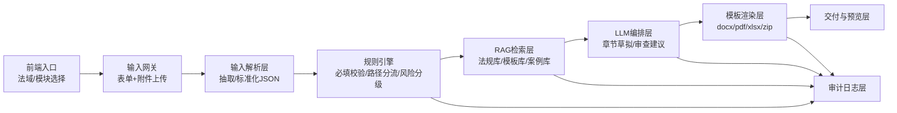

# AI4Law v2 系统架构（v0→v1 演进版）

## 1. 架构目标
将系统实现为“规则约束下的合规文档生产流水线”，而不是纯对话式生成。

核心原则：
1. 规则先行：先校验、后生成。
2. 依据可追溯：每段结论都能回溯法规/案例来源。
3. 模板收口：LLM 不直接排版，统一走模板渲染。

## 2. 总体架构图



## 3. 五层职责与边界

### 3.1 输入解析层（Input Layer）
作用：把用户输入和附件转成标准 JSON。  
当前落地基线：
- `doc/v2/schemas/*.schema.json`
- `doc/v2/schemas/raw/module_input_fields.csv`

### 3.2 规则层（Rule Engine）
作用：确保“不会乱写”。  
包含：
- 字段完整性检查
- 法域路径分流（如 2.1 -> 2.2/2.3）
- 风险等级逻辑（高/中/低）

### 3.3 RAG层（Knowledge Layer）
作用：给生成与判断提供受约束依据。  
知识分层：
- 主信源：法规原文、监管指引
- 次信源：实务解读、案例材料
- 模板源：官方模板与章节映射

### 3.4 LLM推理层（Content Layer）
作用：
- 信息抽取补全
- 章节草稿生成
- 条款问题解释与建议

约束：
- 必须接受规则层和RAG层的上下文输入
- 输出必须符合结构化格式（JSON/字段块）

### 3.5 模板渲染层（Delivery Layer）
作用：将结构化结果渲染为可交付文件。  
工具建议：`docxtpl/python-docx`。  
输出：`docx/pdf/xlsx/zip`。

## 4. RAG 的三种嵌入点

1. 规则补充检索  
- 用途：把“适用条款/阈值/条件”注入规则执行上下文。  
- 场景：2.2、2.3、4.2。

2. 章节草拟检索  
- 用途：为 LLM 提供章节级依据片段。  
- 场景：3.3、3.4、4.2。

3. 风险判断检索  
- 用途：结合案例/条款对风险进行可解释评级。  
- 场景：3.1、3.2、2.5。

## 5. v0 与 v1 演进路线

| 版本 | 目标 | 技术范围 | 交付标准 |
|---|---|---|---|
| v0 | 跑通端到端 | Schema校验 + 基础规则 + 基础RAG + 模板渲染 | 至少1个模块（建议2.2）稳定输出 docx/zip |
| v1 | 提升准确性与可扩展性 | Hybrid检索（BM25+向量）+ rerank + 自检链路 | 多模块可复用，引用可追溯，评测可回归 |

## 6. 模块映射（当前优先级）

1. 第一优先：2.2  
输入规范和模板素材最完整，适合作为骨架模块。

2. 第二优先：2.3 / 3.3 / 3.4  
已补齐字段草案与模板源，适合复用同一流水线。

3. 第三优先：3.1 / 3.2 / 2.5  
重点在条款级审查与问题定位。

4. 待补齐：4.1  
当前输入明确，但仍缺章节级输出映射素材。

## 7. 工程落地最小目录建议

```text
backend/
  api/
  modules/
    m22_assessment/
    m23_pipia/
    m33_dpia/
    m34_tia/
  rules/
  rag/
  render/
  audit/
```

## 8. 与现有文档的关系

本文件是系统总图，配套文档如下：
- `doc/v2/detailStep.md`：任务拆解与缺口状态
- `doc/v2/api-design-v0.md`：接口设计（API + 状态机）
- `doc/v2/component/*`：模块级输入输出规范
- `doc/v2/schemas/raw/*`：截图转写字段基线
- `doc/v2/assets/templates/*`：模板与依据映射
