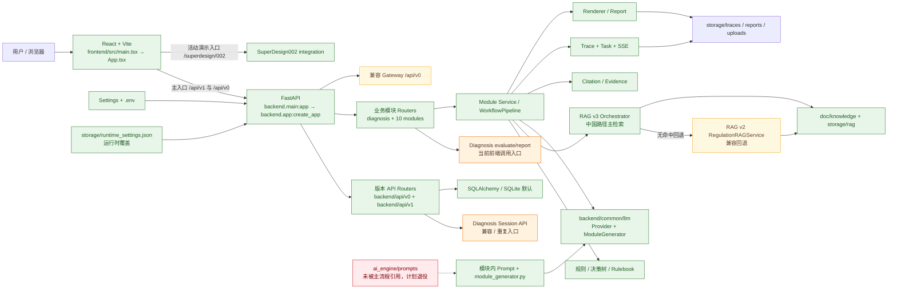

# DataComplyFlow 仓库治理与结构收敛方案

> 审计日期：2026-07-13（Asia/Shanghai）  
> 审计对象：AI4Law / 数规通 DataComplyFlow 当前本地仓库  
> 审计性质：事实审计与分批执行计划；本轮未删除资产、未修改业务代码、配置、Prompt、规则或测试  
> 事实状态词：**已确认 / 部分确认 / 未确认 / 需要人工确认**

## 1. 目的、边界与事实依据

本文的目标是把当前可运行主线、兼容层、重复实现、生成物、研究资产和敏感来源不明资产分开，形成可独立回滚的治理路线，而不是为了目录整齐而搬迁或重写系统。

事实依据按优先级为：

1. 当前检出代码、Git 索引和反向引用结果；
2. 当前测试运行结果、Trace、报告和运行文件；
3. 生效配置、路由挂载、前端请求与真实调用链；
4. [《AI4Law 项目事实基线与真实系统理解》](./AI4Law_项目事实基线与真实系统理解.md)；
5. [《DataComplyFlow 评测资产与 Benchmark 实现可行性分析》](./DataComplyFlow%20评测资产与%20Benchmark%20实现可行性分析.md)；
6. README、历史技术文档和注释。

本轮执行了 `git status`、`git ls-files`、`git grep`/`Select-String` 反向引用、文件数量与体积统计、SHA-256 计算、入口和路由检查；沿用同一 commit 上已完成的全量测试结果。本轮没有提交、打 tag、删除文件或改动产品行为。

## 2. 冻结当前基线

### 2.1 Git 身份与工作树

| 项目 | 当前事实 | 认定 |
|---|---|---|
| Branch | `new` | 已确认 |
| Commit | `398e8acdd446a4ee09a67d8b6b893ed933695394` | 已确认 |
| Commit 摘要 | `fix: allow Cloud Studio preview hosts` | 已确认 |
| Commit 时间 | `2026-06-19T22:27:05+08:00` | 已确认 |
| Dirty status | `?? docs/handoff/` | 已确认；三份审计文档尚未纳入当前 commit |
| 业务代码修改 | 无受跟踪业务文件修改 | 已确认 |

结论：不能直接把当前 HEAD 称为“包含审计材料的完整 pre-refactor 基线”。应先把三份审计文档作为单独文档 commit 纳入，再在该 commit 上打 tag。

### 2.2 关键文件与资产 Hash

算法均为 SHA-256。目录 Hash 是“按仓库相对路径排序，将每个文件相对路径与文件 SHA-256 串联后再次 SHA-256”，因此既约束内容也约束文件集合。

| 类型 | 路径/集合 | SHA-256 | 文件数 |
|---|---|---|---:|
| Python 依赖 | `pyproject.toml` | `07B7A3854BF2C12599D2394F5F916538DC17F9EA2F6D62E30803D8EB04544EA8` | 1 |
| Python 锁 | `uv.lock` | `C9945F40639706CE19CF26F86A2A901322723ECF5AFF529A424924CD7435625B` | 1 |
| 前端依赖 | `frontend/package.json` | `3586C11AEF9EEFAE9E9D4E044CC0891CAC968330B6A90638B32948A430D3F076` | 1 |
| 前端锁 | `frontend/package-lock.json` | `323B52971027E4BCF2D90AAD2B33A130B76EBCC9C6BB239D9915FA18A792E7B8` | 1 |
| 中国路径规则 | `backend/modules/diagnosis/decision_tree.py` | `6DF9670668028C59CEF3F8C86D23CB2BFA942F45AD2B61F7BF0F0BA7C3C70AA8` | 1 |
| 中国 SCC 规则 | `backend/modules/scc/rule_engine.py` | `239899CC932345FA469D90B6C118752C07F2DFF34B699C3334604EC88FE13ADD` | 1 |
| EO 14117 规则 | `backend/modules/us_14117/rule_engine.py` | `0CDE97FEBB74367E5B0D58E19E025895D29DAE3206A7707CEA7187E0DFA895AD` | 1 |
| EU SCC 规则 | `backend/modules/eu_scc/rule_engine.py` | `678DB679156F9C35324E7387005114B519C265441739AD07A950A7ADE27FA560` | 1 |
| CPRA 规则 | `backend/modules/cpra/gap_rules.py` | `9694DBC9B908ECCFC060ECFE71D6A397908D6F92917A1A557AF22B80645490E2` | 1 |
| BCR 规则 | `backend/modules/bcr/bcr_rulebook.py` | `5F0B0669F04BD7A4177157A8ACC59306838AEB351D73C5554F18794D7F652D1C` | 1 |
| 通用审查规则 | `backend/services/review_service/rulebook.py` | `136CD5347337BE3D4FFF0784BDD43D30778B00AE7EEEEF6875C8676FF790613C` | 1 |
| TIA 风险表 | `backend/modules/tia/country_riskbook.json` | `BFC2F97CF1BF3DC31DF673497FA586DD4133E35199EDC8A5A97C3F29F2921DE2` | 1 |
| 公共生成 Prompt | `backend/common/llm/module_generator.py` | `1333C2D060A4E48949B09362B83DCE82D3E662E95AFCCE471B43E917B5A5846E` | 1 |
| 旧 Prompt 目录树 | `ai_engine/prompts/**` | `5D07B24C545AD8749D64970F3B8777877C5116A86756C18D9D07FC620292EA8E` | 3 |
| 模块 Agent 目录树 | `backend/modules/*/agents/**` | `31DDC07CF84CAC2062A36ED9B4417D881CBE24A40DD8BABA09007934B3D4A314` | 125 |
| 当前知识索引 | `storage/rag/v3/**` | `4FF5E3D20AC8B06F81EE477CB57648BD5DD057DEBBE8B1CE836124D1B2248A37` | 30 |
| 运行时配置 | `storage/runtime_settings.json` | `DF95DE5AAC7506CE3D0C90BEF1714E11A9044AF134163EFC6FEA6686FAC1E8DF` | 1 |
| 事实基线文档 | `docs/handoff/AI4Law_项目事实基线与真实系统理解.md` | `1678FDBAF0B3C02BF1E79B9D6BC26FAA823902D9021C41B48DE1F74A57034AAA` | 1 |
| Benchmark 审计文档 | `docs/handoff/DataComplyFlow 评测资产与 Benchmark 实现可行性分析.md` | `15D53834282A374102BF8501ACD26BE884C647563DDB521989687D10DBD6D312` | 1 |

注：`TIA country_riskbook` 的 Hash 在实际复核时应以自动生成的 baseline manifest 再计算一次；上表值仅用于本次工作树冻结，不代替正式 release manifest。

### 2.3 建议 tag

建议在“三份审计文档已提交、业务代码仍为 398e8acd 内容”的新 commit 上创建 annotated tag：

```text
baseline/datacomplyflow-pre-governance-20260713
```

tag message 至少记录：父 commit `398e8acd`、Python/Node 版本、上述关键 Hash、全量测试摘要和已知 P1 列表。若必须立即标记当前 HEAD，则使用 `baseline/datacomplyflow-398e8acd-pre-governance-20260713`，但必须明确该 tag 不包含三份审计文档。

### 2.4 测试基线与失败清单

已执行命令：

```powershell
uv run --frozen pytest -q
```

环境与结果：Python 3.13.3；`290 passed, 18 failed, 17 errors, 133 warnings`；166.13 秒。测试发生在同一 commit，临时 `.venv`、测试 trace、数据库和运行配置副作用已清理。本轮没有重复安装环境或重跑全量套件。

| 失败组 | 数量/现象 | 根因或当前证据 | 分类 |
|---|---|---|---|
| Assessment | 2 failed | 最终 LLM prompt 未满足 context pack issue 断言；retriever query 未包含预期 profile 字段 | P1 回归/契约 |
| 中国 SCC | 5 个核心 service 失败并牵连 async | `backend/modules/scc/service.py:generate_report()` 使用 `uuid` 但未导入 | P1 明确 Bug |
| CN Flow | service、async、v0 失败 | `CNFlowService._build_context_pack()` 不接受公共 Pipeline 传入的 `per_issue_rag` | P1 明确契约 Bug |
| BCR/CPRA/DPIA/PIPIA/TIA 等 async | 多项返回 401 | 测试预期匿名 200，但当前路由要求鉴权 | P1 测试/API 契约决策，不应简单删鉴权 |
| v0 DPIA | 返回 400 | gateway payload 到当前 DPIA schema 映射不一致 | P1 兼容入口 Bug |
| knowledge review | 17 errors | Windows teardown 删除临时 SQLite 时句柄仍占用 | P1 测试资源释放 |

18 个 failed 的测试名称应在首次治理 commit 的 machine-readable manifest 中原样保存；当前事实基线文档第 15 节保留了本次运行结论。任何清理 commit 若使 passed 数低于 290、或新增非既知失败，均应回退。
本次 18 个 failed node 的冻结清单如下（17 个 knowledge review teardown 属于 errors，不在此列）：

```text
backend/modules/assessment/tests/test_chapter_context.py::test_final_llm_prompt_contains_context_pack_issue
backend/modules/assessment/tests/test_service.py::test_assessment_retriever_query_contains_profile_fields
backend/modules/bcr/tests/test_async_api.py::test_bcr_async_flow
backend/modules/cn_flow/tests/test_async_api.py::test_cn_flow_async_flow
backend/modules/cn_flow/tests/test_service.py::test_cn_flow_generate_report
backend/modules/cpra/tests/test_async_api.py::test_cpra_async_flow
backend/modules/dpia/tests/test_async_api.py::test_dpia_async_flow
backend/modules/pipia/tests/test_async_api.py::test_pipia_async_flow
backend/modules/scc/tests/test_async_api.py::test_scc_async_flow
backend/modules/scc/tests/test_service.py::test_scc_generate_report_fallback
backend/modules/scc/tests/test_service.py::test_scc_generate_with_data_fields
backend/modules/scc/tests/test_service.py::test_scc_generate_security_assessment_trigger
backend/modules/scc/tests/test_service.py::test_scc_generate_hr_exemption
backend/modules/scc/tests/test_service.py::test_scc_explanation_output
backend/modules/scc/tests/test_service.py::test_scc_generate_annotated_docx
backend/modules/tia/tests/test_async_api.py::test_tia_async_flow
backend/modules/v0_task_gateway/tests/test_api.py::test_v0_task_gateway_dpia_flow
backend/modules/v0_task_gateway/tests/test_api.py::test_v0_task_gateway_cn_flow_flow
```

## 3. 仓库资产分类

### 3.1 分类口径

| 分类 | 判定口径 |
|---|---|
| active | 当前被入口、路由、import、脚本或测试真实调用 |
| duplicate | 内容或业务责任重复，且存在两个实际来源 |
| obsolete | 指向不存在对象、无仓库内引用，且已被现入口取代 |
| legacy-compatible | 仍为兼容 API、fallback 或历史用法提供行为，暂不能删 |
| generated | 可由源码/构建命令重建，不应作为手工权威源 |
| runtime artifact | 某次运行产生的 trace、报告、上传或数据库状态 |
| research asset | 论文、实验、评测快照或方法记录，不等于产品实现 |
| competition document | 比赛材料、演示文档或发布包材料 |
| sensitive/unknown provenance | 可能包含用户文件、绝对路径、密钥或来源无法证明 |

### 3.2 主要目录与文件

| 资产 | 规模 | 分类 | 活动证据/风险 | 治理结论 |
|---|---:|---|---|---|
| `backend/` | 后端主体 | active | `backend.main:app`、`backend.app:create_app()`、全部 Router/Service | 保留主流程 |
| `backend/common/llm/` | 公共 LLM | active | 多模块 import；`module_generator.py` 为公共章节生成入口 | 设为 LLM 权威实现 |
| `backend/common/rag/` | RAG v2/v3 | active + legacy-compatible | `retrieve_regulations()` 对 CN 优先 v3，随后 v2 fallback；EU/US 仍走 v2 服务 | v3 和 v2 现阶段都保留 |
| `backend/common/workflow/` | 公共 Pipeline/IR | active | assessment、CN Flow、EO 14117 等调用 | 保留；不强迁其他模块 |
| `backend/modules/*` | 业务模块 | active | Router 被 `backend/main.py` 挂载，Service/测试存在 | 保留；逐模块修 Bug |
| `backend/api/diagnosis.py` | Session diagnosis API | legacy-compatible + duplicate | `/api/v1/diagnosis/sessions*` 被通用 router 挂载；前端未检出调用 | 标兼容边界，先加契约测试再决定退役 |
| `backend/modules/diagnosis/router.py` | evaluate/report diagnosis API | active + duplicate | `/api/v1/diagnosis/report` 被前端调用 | 作为当前交互主入口 |
| `frontend/src/` | React/Vite 前端 | active | `main.tsx`、`App.tsx` | 保留 |
| `frontend/src/integrations/superdesign002/` | 96 文件，约 0.59 MB | active generated integration | `App.tsx` 挂载 `/superdesign/002`，页面直接 import | 不可按生成物删除；应标“活动演示 UI” |
| `frontend/.codex-archives/` | 135 文件，约 7.0 MB，约 116k 文本行 | duplicate + generated archive | 无活动代码引用；多轮前端修复快照 | P0 可删，Git 历史已保留 |
| `frontend/tmp/` | 163 文件，约 9.1 MB，约 43k 行 | research/runtime + unknown provenance | 比较脚本、实验输出；活动代码未引用，历史 trace 有路径文本引用 | 人工确认后移至外部研究归档，不直接删 |
| `frontend/storage/` | 1,599 文件，约 22.5 MB，约 481k 行 | runtime artifact + sensitive/unknown | 运行 trace/history，存在绝对本机路径/内容快照 | 从主仓移除前必须脱敏、确认留存义务 |
| `ai_engine/` | 5 文件 | obsolete candidate | 仓库内未检出外部 import；Prompt 与 `backend/common/llm` 重复 | 人工确认无外部消费者后删除或 `legacy/` 冻结 |
| `doc/knowledge/_evaluation/` | 9 文件，67.8 KB | active research asset / 目标 canonical | builder 与 `qa_rag_eval_v2.py` 使用 `NEW_EVALUATION_DIR` | 设为唯一 evaluation path |
| `doc/knowledge/evaluation/` | 9 文件，67.8 KB | duplicate + currently active legacy | 与 `_evaluation` 逐文件字节相同；`backend/common/rag/eval.py` 仍硬编码此目录，历史 QA manifest 也记录旧路径 | 先切调用与元数据，再删除 |
| `doc/knowledge/_index/` | 5 文件，125.6 KB | active/generated knowledge index | 新路径体系 | 保留，构建可重现化 |
| `doc/knowledge/index/` | 2 文件，10.5 KB | legacy-compatible/duplicate | 旧路径兼容 | 查所有 loader 后再退役 |
| `doc/knowledge/_registry/` | 4 文件，1.52 MB | active knowledge registry | 新路径体系 | 保留，纳入 Hash/版本 |
| `doc/knowledge/registry/` | 2 文件，22.4 KB | legacy-compatible/duplicate | 旧路径兼容 | 查 loader 与输出差异后退役 |
| `doc/knowledge/normalized/` | 2 文件，1.36 MB | active source-derived asset | v2/v3 ingest 和构建来源之一 | 保留；补 provenance manifest |
| `storage/rag/` | 31 文件，18.9 MB | generated active index | v3 当前索引 30 文件；运行依赖 | 可发布为版本化构建产物，不作为手工源 |
| `storage/traces/` | 751 文件，11.2 MB | runtime + research + unknown provenance | 可作实验材料，但缺 dataset/source/user 标识 | 主仓默认不继续累积；先清点脱敏 |
| `storage/reports/` | 16 文件，1.33 MB | runtime/demo/unknown | 通用审查 DOCX；真实性与授权未确认 | 人工确认后保留匿名 demo 或移出主仓 |
| `storage/uploads/` | 48 文件，12.1 MB | runtime + sensitive/unknown | 用户/演示上传文件来源不明 | 高优先级隔离和脱敏，不直接公开 |
| `storage/runtime_settings.json` | 1 文件 | runtime config + sensitive | 当前受跟踪，包含非空 API 凭据字段 | P1 立即轮换；改为 ignored runtime file + redacted example |
| `qa/` | RAG baseline/eval 与 regression | research asset | 包含 v1/v2 结果和 v0 expected output | 保留，后续拆分 canonical benchmark 与历史 runs |
| `qa/rag_eval_v2.json` 与 `qa/regression/rag_eval_v2_20260404.json` | 两份大 JSON | duplicate snapshot | 当前文件与 20260404 快照字节一致 | 可保留“latest + dated snapshot”，但用 manifest/链接消除复制需人工决策 |
| `tests/` 与模块内 tests | 测试主体 | active | 290 passed 的依据 | 必须保留 |
| `doc/error/` | 7 文件，74.7 KB | research/history | 旧重构方案和错误记录 | 移至文档历史区，不作为当前事实 |
| `doc/tmp/` | 12 文件，439.6 KB | research/temporary | 开发中间材料 | 人工确认后归档/删除 |
| `doc/addition/` | 28 文件，约 61.7 MB | competition/research + unknown | 大型外部材料，来源与许可需核查 | 不直接删；建立来源和许可清单 |
| `doc/v2/` | 9 文件 | competition/legacy | 旧模板/材料；旧发布脚本还错误引用不存在的 `doc/v2/plan.md` | 保留材料，修/退役脚本 |
| `docs/handoff/` | 3 份当前审计 | active canonical documentation | 当前事实、Benchmark、治理方案 | 设为当前权威交接文档 |
| `docs/superpowers/`、`.superpowers/` | 设计/头脑风暴和运行状态 | research + generated state | `.superpowers/.../server.*` 是被跟踪的运行状态 | 保留设计文档；删运行状态文件 |
| `paper/` | 14 文件，约 27.3 MB | research asset | 论文与研究材料 | 保留，明确非产品事实 |
| `.vite/` | 2 文件 | generated cache | 已被跟踪，且 `.gitignore` 未覆盖 | P0 删除并 ignore |
| `.DS_Store`、`doc/.DS_Store` | 2 文件 | generated | 已跟踪，根 `.gitignore` 已声明但不能自动移除索引 | P0 删除索引项 |
| `backend/modules/us_14117/agents/__pycache__/` | 6 `.pyc` | generated | 已跟踪，`.gitignore` 已声明 | P0 删除索引项 |
| `scripts/frontend_v0_linkage_check.*` | 2 文件 | obsolete | 指向不存在的 `app_streamlit/`，无其他仓库引用 | P0 删除或移入 legacy 记录 |
| `scripts/release_v0_package.sh` | 1 文件 | obsolete/broken | 引用不存在的 `doc/v2/plan.md`，依赖 `.venv311` | 退役；若仍需发布则另建有效 release 脚本 |
| `scripts/demo_v0.sh` | 1 文件 | legacy-compatible | 仅打印 `.venv311` 启动方式，可能仍供人工演示参考 | 更新为 uv/npm 或移入 legacy，需确认比赛流程 |
| `scripts/ingest_legal_texts.py` | 1 文件 | obsolete/broken source path | 指向不存在的 `doc/v3/...`，但可能代表不可重建的历史入库方法 | 不直接删；先保留为 migration history 并标失效 |

### 3.3 v1/v2/v3、LLM 与 diagnosis 的边界结论

- **RAG v3 是中国法域的当前优先入口**：`backend/common/rag/retriever.py:retrieve_regulations()` 在 `jurisdiction == "cn"` 时创建 `RetrievalOrchestrator`，命中后返回 v3 结果。
- **RAG v2 不是可删旧版**：v3 无结果时继续使用 `RegulationRAGService`；EU/US 模块也调用该公共入口。应标为 `legacy-compatible fallback`，直到用相同 Case 做 v3 全法域替代验证。
- **qa 中的 v1/v2 是评测代际，不等于运行时实现代际**：不能依据名字统一删除。
- **`backend/common/llm` 是活动源**；`ai_engine/prompts` 未发现主流程调用，只能认定“疑似废弃”，不能证明不存在仓库外消费者。
- **两套 diagnosis 都被后端挂载**；当前前端只调用 module router 的 `/api/v1/diagnosis/report`，session API 是兼容/重复入口。先冻结 OpenAPI 和消费者，再决定合并。

## 4. 删除与保留清单

### 4.1 可安全直接删除（P0，不改变产品行为）

| 项目 | 理由 | 预计减少 |
|---|---|---:|
| `frontend/.codex-archives/` | 无活动引用；内容为重复前端快照；Git 历史可恢复 | 135 文件，约 7.0 MB，约 116k 文本行 |
| `.vite/` | Vite 可重建缓存 | 2 文件 |
| 根目录与 `doc/` 下 `.DS_Store` | OS 元数据，已在 `.gitignore` | 2 文件 |
| `backend/modules/us_14117/agents/__pycache__/` | Python 3.11 bytecode，可重建且已被 ignore | 6 文件 |
| `.superpowers/.../state/server.pid`、`server.log`、`server-stopped` | 本地进程状态，不是设计资产 | 3 文件 |
| `scripts/frontend_v0_linkage_check.py/.sh` | 唯一目标 `app_streamlit/` 不存在，且无仓库内调用者 | 2 文件 |

合计约 **150 文件、至少 7 MB、约 116k 文本行**。删除前仍应在 commit 描述中保留 `git grep` 结果和路径清单；“安全”指对当前仓库主流程无行为影响，不代表外部脚本绝无调用。

### 4.2 需要人工确认后删除或移出主仓

| 项目 | 确认问题 | 建议动作 | 潜在规模 |
|---|---|---|---:|
| `frontend/tmp/` | 是否包含仍需复现实验的方法/唯一结果 | 提取有价值脚本到 `research/`，其余删除 | 163 文件，9.1 MB |
| `frontend/storage/` | 是否含个人/客户数据、是否需留存 | 脱敏后外部归档；主仓删除并 ignore | 1,599 文件，22.5 MB |
| `storage/traces/` | 哪些是 demo、模型实验、真实运行 | 仅保留经 provenance 标记的匿名 benchmark seed | 751 文件，11.2 MB |
| `storage/reports/` | 报告是否授权公开 | 保留匿名 golden demo 或外部归档 | 16 文件，1.33 MB |
| `storage/uploads/` | 上传内容来源/授权 | 默认从 Git 移除；需要的 fixture 重制为合成数据 | 48 文件，12.1 MB |
| `doc/tmp/` | 是否仍是唯一设计记录 | 归档有效内容，其余删除 | 12 文件，0.44 MB |
| `doc/addition/` | 外部材料许可、比赛提交依赖 | 建立 provenance/许可表后再拆分 | 28 文件，61.7 MB |
| `ai_engine/` | 是否有仓库外脚本/比赛演示使用 | 无外部消费者后删除；否则只读冻结于 `legacy/` | 5 文件 |
| `qa/rag_eval_v2.json` 的重复快照 | 是否要求保留 latest 物理副本 | 用 manifest 指向 dated run，避免双份大文件 | 1 个重复大 JSON |

若上述运行目录全部确认可移出，主仓可额外减少约 **2,577 个文件、至少 56 MB**（不含 `doc/addition`）；但这不是本轮建议直接执行的删除量。

### 4.3 应保留但移出活动路径

| 项目 | 目标位置/方式 | 原因 |
|---|---|---|
| 历史设计、错误与开发记录 | `docs/archive/`，首页加日期和“非权威”声明 | 保留决策史但不污染事实入口 |
| 失效入库脚本 | `scripts/legacy/` + `README.md` 写明不可运行 | 可能有方法史价值，当前源目录缺失 |
| 比赛材料 | `docs/competition/<year-or-event>/` | 与产品技术事实分离 |
| 研究/论文材料 | `research/` 或保持 `paper/`，补 `README` | 不将论文主张当代码能力 |
| 经脱敏的历史 trace | `qa/fixtures/traces/` 或外部对象存储 | 只有具备 case_id/provenance 的才可进入 Benchmark |
| Session diagnosis API | 代码暂留，OpenAPI 标 deprecated/compat | 仍被挂载，删除需要消费者证据和迁移窗口 |
| RAG v2 | 保持原路径，文档标 fallback | 当前调用链需要 |

### 4.4 必须留在主流程

`backend/` 活动入口与模块、`frontend/src/`（含 SuperDesign002 活动路由）、`tests/`、模块测试、`backend/common/llm`、`backend/common/rag` v2/v3、`backend/common/workflow`、`doc/knowledge/normalized`、新 index/registry/evaluation、依赖锁、`.env.example`、当前三份 `docs/handoff` 文档必须保留。

## 5. 当前活动架构与入口边界

### 5.1 活动架构图

图例：绿色语义节点为当前活动；黄色为兼容/fallback；橙色为重复责任；红色虚线为未使用且计划退役。Mermaid 源码已用本机 CLI 尝试渲染，CLI 进入图形生成阶段但 Chromium 启动超时，未生成独立 SVG；因此本轮只交付可在 Markdown 渲染器中复核的源码。



### 5.2 入口和权威边界

| 层 | 当前主入口 | 兼容/重复/未使用 | 证据 |
|---|---|---|---|
| 后端启动 | `backend.main:app` → `backend.app:create_app()` | 无 Docker/Compose 入口 | `backend/main.py`、`backend/app.py` |
| 前端启动 | Vite → `frontend/src/main.tsx` → `App.tsx` | README/旧脚本仍有 Streamlit 痕迹但目录不存在 | `frontend/package.json`、`frontend/src/main.tsx` |
| API | `/api/v1` 通用 router + 业务 module routers；`/api/v0` gateway | 两套 diagnosis；v0 是兼容入口 | `backend/app.py`、`backend/main.py`、各 router |
| Service | 各模块 `service.py`；部分使用 `WorkflowPipeline` | 通用审查和多模块保留专用 workflow | `backend/common/workflow/pipeline.py`、模块 service |
| RAG | `retrieve_regulations()`；CN 先 v3 | v2 fallback；外部 DeliLegal 补检索 | `backend/common/rag/retriever.py`、`orchestrator.py` |
| LLM | `backend/common/llm/client.py`、provider、`module_generator.py` | `ai_engine/prompts` 无主流程引用 | import/调用检索 |
| Citation | 公共 workflow 与各模块专用 citation bundle | 未统一 claim-level registry | Schema、模块 service |
| Trace | `backend/common/trace` 和各模块 TraceRecorder | 文件 manifest 与 task/DB 状态非单一事务 | trace 文件与 task manager |
| Task | 进程内 `ThreadPoolExecutor` + SSE | v0/各模块存在相近 async 包装 | `backend/common/tasks/manager.py` |
| Database | SQLAlchemy，默认 SQLite | `create_all` + 手写 legacy ALTER，无 Alembic | `backend/core/db.py`、settings |
| Prompt | 模块内 agent prompt + `module_generator.py` | `ai_engine/prompts` 疑似废弃；Prompt 分散 | 模块 agents、公共 generator |
| 配置 | `Settings`/`.env`，启动时加载 runtime override | `storage/runtime_settings.json` 可覆盖且当前含敏感字段；部分 competition 默认值硬编码 | `backend/core/settings.py`、`runtime_settings.py` |

## 6. 一致性问题清单

| 类别 | 问题 | 证据 | 影响 | 认定 |
|---|---|---|---|---|
| 文档/入口 | README/旧 QA 指向 Streamlit，但 `app_streamlit/` 不存在，当前为 React/Vite | `scripts/frontend_v0_linkage_check.*`、frontend package | 新成员无法正确启动/验收 | 已确认 |
| 发布脚本 | `release_v0_package.sh` 引用不存在的 `doc/v2/plan.md` 与 `.venv311` | 脚本 19、26 行 | 比赛发布不可复现 | 已确认 |
| 入库脚本 | `ingest_legal_texts.py` 指向不存在的 `doc/v3/...` | `SRC_DIR` 与 snapshot_path | 无法从声明原始材料重建 normalized 库 | 已确认 |
| Evaluation | builder 写 `_evaluation`，运行时 `backend/common/rag/eval.py` 硬编码 `evaluation` | paths.py、eval.py:23、QA scripts | 数据集双源；结果 manifest 记录旧路径 | 已确认 |
| Diagnosis | session API 与 evaluate/report API 同名职责、不同 schema/service | `backend/api/diagnosis.py`、`backend/modules/diagnosis/router.py` | 规则和下游 handoff 可能漂移 | 已确认 |
| RAG 版本 | v3 优先仅限 CN，v2 仍为 fallback/其他法域路径 | `retrieve_regulations()` | 文档若称“已全面 v3”会误导 | 已确认 |
| Prompt/法域 | `cn_flow` UI/模块名表示 CN Flow，而公共生成 Prompt 与章节要求写 EO 14117 | `backend/common/llm/module_generator.py`、CN Flow service | 若模块意图是对华流动则命名不清；若意图是中国出境则法域错误 | 已确认存在不一致；业务意图需确认 |
| Prompt 权威源 | 公共 generator、模块 Agent 内嵌 Prompt、`ai_engine/prompts` 并存 | import 检索 | 无统一版本/Hash/适用法域登记 | 已确认 |
| Schema | 公共 Fact/Issue/Evidence/ContextPack 只贯穿部分模块；各模块存在同义字段 | common workflow 与模块 schema | Benchmark adapter 需要逐模块映射 | 已确认 |
| Config 多源 | env、Settings 默认、runtime JSON、前端设置 API、硬编码 competition 默认并存 | settings.py、runtime_settings.py、storage JSON | 同一 commit 运行结果不唯一 | 已确认 |
| 安全配置 | 受跟踪的 runtime JSON 含非空 API 凭据；代码中还存在比赛 API 凭据默认值 | `storage/runtime_settings.json`、`backend/core/runtime_settings.py` | 密钥泄漏、比赛环境风险；Git 历史可能已暴露 | 已确认；值不在本文展示 |
| Task/Trace | task 状态、SSE 事件、trace manifest、文件输出分开更新 | task manager、trace recorder、storage | failed/cancelled 与已有文件可能不一致，难重放 | 部分确认 |
| Cancel 语义 | cancel 可更新状态，但不能保证终止已在线程中执行的工作 | InMemoryTaskManager | UI 显示取消但后台可能继续产物 | 基于代码确认 |
| Verifier 行为 | repair 失败文本可出现，但公共 Pipeline 仍进入 renderer | `WorkflowPipeline.run()` | “阻断”描述与实际输出行为不一致 | 已确认 |
| 鉴权契约 | 多个 async 测试预期匿名成功，现路由返回 401 | 全量测试 | 测试不能作为稳定 API contract | 已确认 |
| Gateway 契约 | v0 DPIA payload 返回 400 | `backend/modules/v0_gateway` 与测试 | 兼容入口不完整 | 已确认 |
| DB/测试 | Windows SQLite teardown 句柄未释放 | 17 errors | CI 噪声、重复运行不可信 | 已确认 |
| 注释/事实 | “Agent”命名中多数是单次 LLM/规则调用，无规划循环 | agents 代码与事实基线 | 文档数量和产品陈述易夸大 | 已确认 |
| 运行资产 provenance | traces/reports/uploads 未统一记录 case_id、demo/real、授权、数据集版本 | storage 文件 | 不能直接转 Gold；可能含敏感信息 | 已确认 |

## 7. 重构分级

### P0：纯清理，不改变行为

1. 提交三份审计文档和 baseline manifest，并打 annotated tag。
2. 删除已跟踪的 `.DS_Store`、`.vite`、`.pyc/__pycache__`、Superpowers server state；补齐 `.gitignore`。
3. 删除 `frontend/.codex-archives`；在 commit 中保存文件清单和反向引用证据。
4. 退役明确失效的 Streamlit linkage scripts；README 改成当前 Vite/FastAPI 启动事实。
5. 给 `docs/archive`、`paper`、比赛材料增加“非当前权威源”入口说明；不在同 commit 大搬文件。
6. 为 runtime 目录先增加 inventory/敏感性标签，不直接批量删除。

### P1：已知 Bug、安全和契约修复

每项应是独立 commit：

1. **安全优先**：撤销/轮换所有已跟踪或硬编码凭据；把 runtime config 改为 ignored 文件，提供无密钥 example；评估 Git 历史清理和协作者通知。历史重写是高影响操作，需单独批准。
2. SCC 增加缺失的 `uuid` import，并只跑 SCC 全链测试。
3. 对齐 CN Flow `_build_context_pack(per_issue_rag=...)` 公共 Pipeline 契约。
4. 定位并修复 assessment prompt/retriever 两项回归。
5. 明确 async API 是否必须鉴权；据此只改测试 fixture 或路由策略，不能为过测直接移除鉴权。
6. 修复 v0 DPIA adapter 映射。
7. 释放 knowledge review SQLite 资源。
8. 确认 CN Flow 业务含义后，修正模块命名或 EO 14117 Prompt 法域；不要与其他 Prompt 重写混合。
9. 将 `_evaluation` 设为 canonical，并以兼容 shim/一次性路径切换保证结果不变；更新旧 QA manifest 的“输入路径”只在新运行中生效，历史结果不篡改。

### P2：低风险结构收敛

1. 建立 Prompt registry（只登记 path/module/jurisdiction/version/hash/input/output，不重写 Prompt）。
2. 为两套 diagnosis 写对照 contract test，标 session API deprecated；有迁移期后再收敛到一个规则核心。
3. 建立统一 runtime config precedence：环境变量/secret store > 显式 runtime override > 安全默认；输出 redacted effective config manifest。
4. 将 trace/task/report 用共同 `run_id` 和 result manifest 关联；不先替换现有 task manager。
5. 建立 `qa/benchmark/` Harness skeleton，以 Adapter 包装现有模块，不迁移全部 workflow。
6. 为 knowledge source/index/eval 生成 provenance 和 Hash manifest。
7. 对已确认可公开的历史 trace 做脱敏、schema migration 和 fixture 化。

### P3：高风险架构重构，暂缓

- 全量统一 FactItem/RuleItem/ClaimItem；
- 全部模块迁到一个公共 Workflow；
- 彻底删除 RAG v2、统一重建 v3 全法域索引；
- 合并全部模块 Prompt 或改为复杂 Agent 编排；
- 替换 task 系统为外部队列、数据库全面迁移/Alembic、对象存储重构；
- Git 历史重写清除敏感数据；
- 大规模移动 `doc/`、`docs/`、`paper/` 和 competition 资产。

这些工作都可能改变比赛演示、历史报告可重现性或 Benchmark baseline，必须在 P0/P1 稳定且 Smoke Benchmark 可运行后单独立项。

## 8. 最小目标目录与权威源

不要求立即物理迁移，先通过 README、manifest 和加载器建立逻辑权威源：

```text
backend/                       # 产品代码
  common/llm/                  # Canonical LLM implementation
  common/rag/                  # v3 primary + v2 compatibility
  common/workflow/             # 已接入模块的公共 IR/Workflow
  modules/                     # 模块业务实现
frontend/src/                  # Canonical frontend
doc/knowledge/
  normalized/                  # Canonical normalized legal source
  _registry/                   # Canonical registry
  _index/                      # Canonical source-side index metadata
  _evaluation/                 # Canonical RAG evaluation data
docs/handoff/                  # 当前权威技术事实与治理文档
docs/archive/                  # 历史/非权威文档（渐进迁移）
qa/
  benchmark/                   # 第一版产品 Benchmark Harness 与 cases
  regression/                  # 不可变历史运行
  fixtures/                    # 明确合成/匿名且有 provenance 的输入
storage/                       # 默认 ignored 的本地运行目录
  rag/                         # 可重建索引；release 可附 hash manifest
  traces/ reports/ uploads/    # 不进入产品源码 commit
research/ 或 paper/            # 研究资产，非产品事实
```

### 8.1 权威源决议

| 领域 | 建议 Canonical | Legacy 处理 |
|---|---|---|
| 当前技术文档 | `docs/handoff/*.md` + 后续 `docs/handoff/README.md` 索引 | 其他 doc 标日期/状态，渐进移到 archive |
| Evaluation | `doc/knowledge/_evaluation/` | `evaluation/` 先兼容读取/迁移，后删除 |
| Benchmark | `qa/benchmark/` | `qa/baseline`、`qa/regression` 保持不可变历史 |
| Prompt registry | 新增轻量 `backend/common/llm/prompt_registry.yaml` 或 JSON manifest | 仅登记现有 Prompt；`ai_engine/prompts` 标 legacy 后退役 |
| Runtime config | `Settings` schema + 环境变量/secret store；redacted example | `storage/runtime_settings.json` 变为本地 ignored override |
| 法规源 | `doc/knowledge/normalized` + `_registry` provenance | 原始外部材料独立授权/来源管理 |
| 知识索引 | 构建脚本 + normalized/registry + build manifest | `storage/rag/v3` 是可重建发布产物；v2 是兼容 fallback |
| API | `/api/v1` module routers；通用 API 保留基础资源 | `/api/v0` 和 diagnosis session 标 compatibility/deprecated |
| Trace/结果 | 未来 `qa/benchmark/runs/<run_id>/manifest.json` | 旧 storage 只作为待清洗历史资产 |

## 9. 测试、验收与回退

### 9.1 通用门禁

每批 commit 都必须：

1. `git diff --check`；
2. `uv run --frozen pytest -q`，passed 不低于 290，失败只能来自冻结清单；
3. 前端依赖可用时执行 `npm ci` 后 `npm run build`；锁文件不得漂移；
4. 导出/比较 FastAPI OpenAPI route snapshot；
5. 对规则、Prompt、knowledge index 重算 Hash；非目标资产 Hash 不得变化；
6. Benchmark skeleton 落地后执行固定 smoke cases，比较 manifest schema、路径结果和失败分类；
7. 若出现未解释的新失败、路由消失、fallback 行为变化、报告不可打开或敏感数据再次入库，立即回退该 commit。

### 9.2 分批修改验收表

| 批次 | 计划修改 | 必跑测试/命令 | 行为不变检查 | 回退条件 |
|---|---|---|---|---|
| Baseline | `docs/handoff`、baseline manifest；tag | Hash 校验、`git status`、文档链接检查 | 业务文件树 Hash 不变 | 文档遗漏 dirty/test/hash 或 tag 指向错误 |
| Generated cleanup | `.gitignore`、缓存/归档删除 | `git grep` 被删路径；backend import smoke；frontend build | OpenAPI 和 bundle route 列表不变 | 任一活动 import/route 丢失 |
| Evaluation canonical | `paths.py`、`rag/eval.py`、QA scripts/docs；删 legacy 数据副本 | `backend/common/rag/tests`、`python -m backend.common.rag.run_eval --mode all --target all` | 输入文件内容 Hash 和指标不变 | case 数/指标/路径解析变化 |
| Entrypoint docs | README、旧脚本退役 | 启动 backend health；frontend build；link check 替代脚本 | `/health`、主页面、模块路由可达 | 比赛启动流程无法复现 |
| Security config | settings/runtime loader/example/gitignore | runtime settings 单测、redaction test、secret scan | 使用环境变量仍能选择同 provider/model | 凭据落盘/日志暴露或 provider 选择变化 |
| SCC Bug | `backend/modules/scc/service.py` | SCC service、router、async、DOCX tests | 相同 fixture 结构/规则结果不变 | 新异常、输出 schema 变化 |
| CN Flow Bug | `backend/modules/cn_flow/service.py` | CN Flow service/async/v0 tests | ContextPack 含 per-issue RAG 且旧字段保留 | 其他 Pipeline 模块回归 |
| Assessment regressions | assessment retriever/generator 的最小目标文件 | assessment service/retriever/prompt tests | 诊断、facts、issues、citations 数量符合 fixture | 为过测删除必要上下文 |
| Auth contract | 测试 fixture 或安全策略文件，二选一 | auth + 各模块 async API tests | 未授权仍符合决策后的契约 | 安全边界意外放宽 |
| v0 DPIA | gateway adapter | v0 DPIA + DPIA service tests | v1 schema/路由不变 | v0 成功但字段静默丢失 |
| SQLite teardown | knowledge review fixture/session close | knowledge review 全套重复运行两次 | 无功能断言变化 | 仍有锁或引入跨测试状态 |
| Harness skeleton | `qa/benchmark/**`，不改模块 | smoke runner、schema/metric unit tests | adapters 调同一 public service/函数 | Harness 内复制法律规则或绕过真实调用链 |
| Baseline run | 只新增不可变 run manifest/report | 固定 seed/config；全部 smoke | Git/模型/数据/Prompt Hash 完整 | 缺配置、无法重放或 Gold 泄漏 |

### 9.3 建议验收命令

```powershell
uv run --frozen pytest -q
uv run --frozen pytest backend/common/rag/tests -q
uv run --frozen python -m backend.common.rag.run_eval --mode all --target all
uv run --frozen python -c "from backend.main import app; print(len(app.routes))"
git diff --check
git status --short
```

前端在 `frontend/` 下：

```powershell
npm ci
npm run build
```

测试会产生 trace、SQLite 或 runtime 文件时，应设置临时 `storage_dir`，并在结束后断言工作树只出现预期结果 manifest；不能依赖人工清理来维持干净状态。

## 10. 分批 Commit 与 tag 计划

原则：每个 commit 目标单一、可独立回滚；不把清理、Bug、安全和算法改动混在一起。以下是建议顺序，不代表本轮已执行。

| 顺序 | 建议 commit/tag | 唯一目标 | 主要文件 |
|---:|---|---|---|
| 1 | `docs: freeze pre-governance baseline` | 纳入三份审计与 machine-readable baseline | `docs/handoff/**`、可选 `qa/baseline/pre_governance_20260713.json` |
| 2 | annotated tag | 固定 pre-refactor 身份 | `baseline/datacomplyflow-pre-governance-20260713` |
| 3 | `chore: remove tracked generated artifacts` | 删除 OS/cache/bytecode/server state | `.DS_Store`、`.vite`、`__pycache__`、`.superpowers/.../state`、`.gitignore` |
| 4 | `chore(frontend): remove unreferenced codex archives` | 仅删前端重复快照 | `frontend/.codex-archives/**` |
| 5 | `docs: retire missing streamlit entrypoint` | 修正启动事实并退役无目标脚本 | README、`scripts/frontend_v0_linkage_check.*` |
| 6 | `security: remove tracked runtime credentials` | 凭据轮换后的代码侧安全配置 | runtime example、settings loader、gitignore、secret tests；不含历史重写 |
| 7 | `qa: make underscore evaluation directory canonical` | 单一 evaluation 数据源 | paths、rag eval、QA scripts/docs、删除字节重复 legacy 目录 |
| 8 | `docs: mark diagnosis and v0 compatibility boundaries` | 只声明/测试入口边界 | OpenAPI flags、contract snapshot、文档 |
| 9 | `fix(scc): restore report generation` | 修缺失 uuid | SCC service/tests |
| 10 | `fix(cn-flow): align context pack contract` | 修 per_issue_rag | CN Flow service/tests |
| 11 | `fix(assessment): restore prompt context contract` | 只修 prompt context 回归 | assessment 目标文件/tests |
| 12 | `fix(assessment): restore retrieval query contract` | 只修 retriever query 回归 | assessment retriever/tests |
| 13 | `test(api): align async authentication contract` | 明确并固定 auth 契约 | auth fixtures/async tests；若产品策略改变则另行安全评审 |
| 14 | `fix(v0): map dpia payload to current schema` | 修兼容 adapter | v0 gateway/tests |
| 15 | `test(knowledge): release sqlite resources` | 消除 Windows teardown error | knowledge review fixtures/session lifecycle |
| 16 | `qa: add benchmark harness skeleton` | Case/Runner/Adapter/Metric/Manifest 空骨架 | `qa/benchmark/**` |
| 17 | `qa: record first smoke baseline run` | 只提交不可变运行结果 | `qa/benchmark/runs/<run_id>/**` |

`config/entrypoint consolidation` 不应是一个大 commit：启动文档、敏感配置、evaluation path 和 API compatibility 分开提交。`known bug fixes` 也应按模块拆分，确保比赛前可选择性 cherry-pick 和回滚。

## 11. 第一轮执行优先级与停止条件

建议先做：

1. 安全响应：轮换已暴露凭据，禁止继续向 Git 写 runtime secrets；
2. 提交审计基线并 tag；
3. P0 generated/archive 清理；
4. SCC、CN Flow、assessment、SQLite 等单点 P1；
5. evaluation canonical；
6. Benchmark Harness skeleton 与首次 Smoke run；
7. 再评估 diagnosis、RAG v2 和历史 runtime 资产的退役。

以下任一情况应停止批量治理并请求人工决策：

- 无法确定 uploads/reports/traces 的数据所有权、授权或保留义务；
- 比赛部署仍依赖某个“仓库内无引用”的外部脚本；
- 移除 v2 会改变 EU/US 或 CN fallback 结果；
- CN Flow 的产品语义无法确定是“中国数据出境”还是“受 EO 14117 约束的对华数据流”；
- 安全处置需要重写共享 Git 历史；
- 任一 commit 使通过测试少于 290 或产生新的失败类别。

## 12. 结论

当前仓库不是一个可以通过“删除所有 v1/v2、旧目录和生成目录”快速收敛的项目。真实情况是：

1. **主入口可明确**：React/Vite 前端、FastAPI 后端、模块 Router/Service、CN v3 RAG + v2 fallback、公共 LLM/Workflow 和文件化 Trace 构成当前活动基线。
2. **最危险的不是目录杂乱，而是安全与契约**：受跟踪 runtime 配置含凭据；SCC、CN Flow、assessment、v0 DPIA、async auth 测试和 SQLite teardown 存在已复现断链。
3. **可做一批低风险清理**：约 150 个明确生成/重复/失效文件可在独立 P0 commits 删除；大量 storage/tmp 内容必须先做 provenance 与敏感性审查。
4. **单一事实来源可渐进建立**：`docs/handoff`、`doc/knowledge/_evaluation`、`backend/common/llm`、Settings schema、`qa/benchmark` 分别承担文档、评测、LLM、配置和 Benchmark 权威源，无需先统一重构全部模块。
5. **Benchmark 是收敛门禁**：每次路径、配置、RAG、Prompt 或 API 收敛都必须记录 Git/数据/规则/Prompt Hash，并用固定 Smoke Cases 对比；否则“结构更整齐”无法证明行为未漂移。

本方案只给出事实与执行顺序。本轮未实施删除、Bug 修复、配置迁移、Prompt 修改、Benchmark Harness 或 Git tag。

