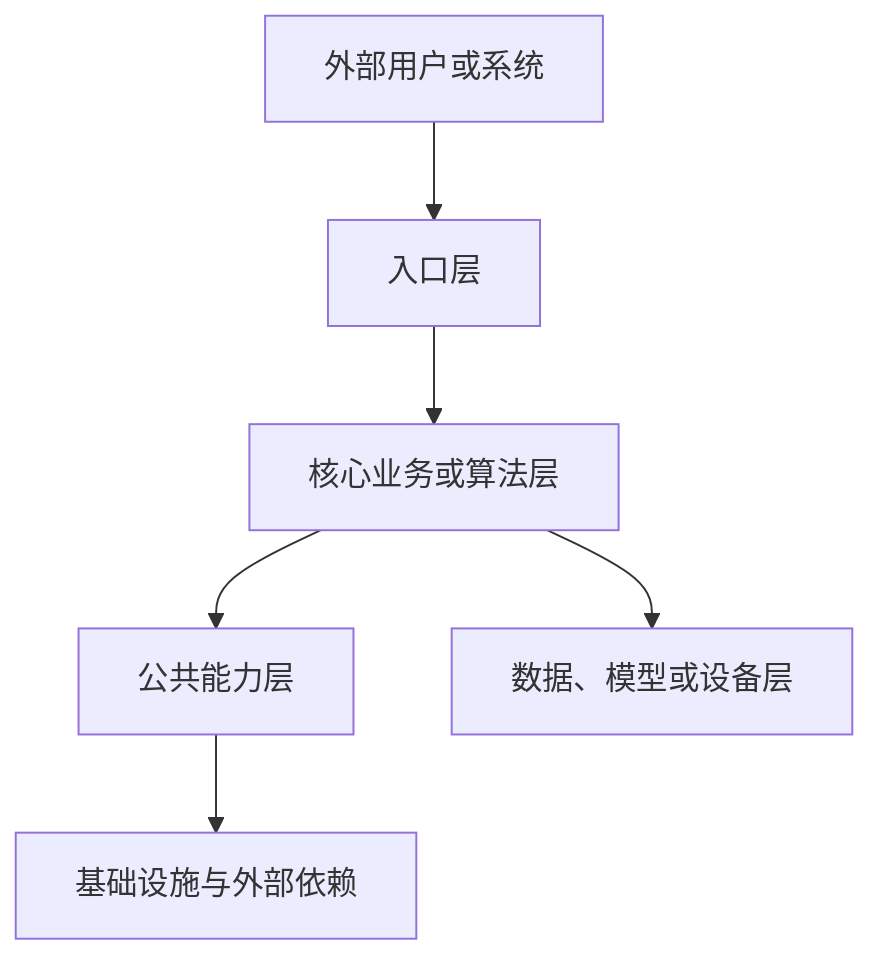
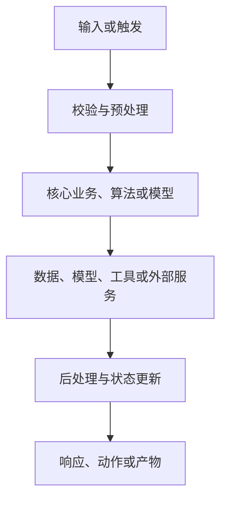
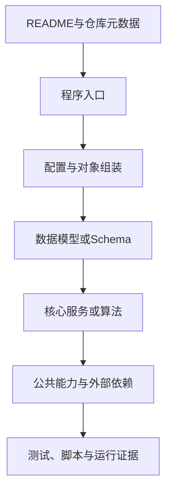

# {仓库名称}代码仓库事实基线与系统理解文档

> **Type**：Template  
> **Status**：Frozen  
> **Version**：V1.0.0  
> **Last Updated**：2026-08-04  
> **Scope**：开源、闭源及内部代码仓库的事实基线、系统理解与核心资产抽取  
> **Consumers**：Human / AI / Downstream Documents  
> **Related Materials**：`README_PHD_Experience_20260804.md`  

---

## 快速入口

### 核心使用原则

> **本文档不是代码目录的机械抄录，也不是普通 README 的简单扩展。它应当把分散在代码、配置、测试、运行记录和现有文档中的事实，组织成一份既能被团队成员理解、又能被AI稳定检索、审查和复用的中间知识基线。**

该文档位于原始仓库与后续知识生产之间：

```text
代码、配置、测试、运行记录、现有文档
                    ↓
代码仓库事实基线与系统理解文档
                    ↓
团队对齐与维护交接
AI 上下文输入与事实审查
需求、设计、实现、测试等工程文档
项目材料、论文、Proposal、Benchmark
代码修改、问题定位与版本差异分析
```

### 当前仓库摘要

| 项目 | 内容 |
|---|---|
| 仓库一句话定位 | {填写} |
| 当前基线 | `{branch / tag / commit}` |
| 分析范围 | {填写} |
| 核心执行链 | `FLOW-001`：{填写} |
| 核心模块 | {引用`MOD-*`} |
| 运行验证状态 | {填写} |
| 主要限制 | {引用`LIM-*`} |
| 关键未决事项 | {引用`OPEN-*`} |

---

## 文档读取与证据约定

> 本节用于帮助人类和AI正确理解本项目文档。模板生成、裁剪和冻结操作说明统一放在附录F；形成项目正式版后，可按团队规范保留或删除附录F。

### 人类与AI双重可读结构

本文同时包含三层信息：

| 层次 | 面向人的作用 | 面向AI的作用 |
|---|---|---|
| 叙事解释层 | 讲清仓库是什么、为什么这样组织、怎样运行 | 建立系统级语义模型 |
| 结构化资产层 | 快速查找模块、接口、数据、配置和验证状态 | 稳定抽取核心资产与关系 |
| 证据与边界层 | 判断结论是否可信、适用到哪里 | 区分事实、推断、不确定性与历史信息 |

```text
叙事层回答“怎样理解”
结构层回答“有哪些资产”
证据层回答“凭什么这样判断，以及不得据此推导的内容”
```

### 证据类型与适用权威

证据类型不是机械的线性高低等级。应根据待判断的问题选择主要证据，并在冲突时记录环境、配置、数据与版本差异。

| 编号 | 证据类型 | 典型来源 | 主要适用问题 |
|---|---|---|---|
| E1 | 运行证据 | 真实命令、测试结果、Trace、日志、产物 | 当前环境是否实际运行、运行时发生了什么 |
| E2 | 代码证据 | 当前Commit中的源码、配置、Schema、脚本 | 当前版本是否存在某种实现、实现位置与机制 |
| E3 | 当前文档证据 | 同版本README、接口文档、设计说明 | 项目如何声明目标、用法和设计意图 |
| E4 | 分析推断 | 基于代码关系形成的解释 | 尚未运行验证的合理判断 |
| E5 | 历史信息 | 旧分支、归档文档、过期设计 | 兼容代码、历史演进和旧决策背景 |

典型判断规则：

| 待判断问题 | 主要证据 |
|---|---|
| 当前代码是否实现某项机制 | E2 |
| 当前环境是否实际可用 | E1 |
| 完整运行链如何发生 | E1与E2联合 |
| 项目声明的目标是什么 | E3 |
| 架构设计意图可能是什么 | E2与E3；必要时标记E4 |
| 某段兼容代码为何存在 | E5；不得代替当前事实 |

### 资产ID与生命周期

| 资产类型 | 标识前缀 | 示例 |
|---|---|---|
| 仓库事实 | `REPO-*` | `REPO-001` |
| 组件或模块 | `MOD-*` | `MOD-003` |
| 执行链 | `FLOW-*` | `FLOW-001` |
| 数据对象或数据集 | `DATA-*` | `DATA-004` |
| API接口 | `API-*` | `API-002` |
| CLI命令 | `CLI-*` | `CLI-001` |
| UI入口 | `UI-*` | `UI-003` |
| 公共库接口 | `LIB-*` | `LIB-001` |
| 配置与契约 | `CFG-*` | `CFG-005` |
| 外部依赖 | `DEP-*` | `DEP-002` |
| 验证项 | `VER-*` | `VER-007` |
| 已知限制 | `LIM-*` | `LIM-003` |
| 未决事项 | `OPEN-*` | `OPEN-002` |
| 技术债 | `TD-*` | `TD-004` |
| 关联文档 | `DOC-*` | `DOC-001` |

资产ID遵循：

1. 同一基线中唯一；
2. 不因排序变化重新编号；
3. 资产改名但职责连续时保留原ID；
4. 资产拆分时保留原ID并新增子资产；
5. 资产废弃时标记“已废弃”，编号不得复用；
6. 正文、注册表、证据账本和版本记录使用同一ID；
7. 只给关键资产编号，不逐函数、逐样式文件机械编号。

### 状态维度

| 维度 | 推荐状态 |
|---|---|
| 实现状态 | 已实现 / 部分实现 / 未实现 / 已废弃 / 不适用 |
| 验证状态 | 已运行验证 / 仅静态核实 / 待核实 / 证据不足 |
| 可用条件 | 可直接运行 / 依赖配置 / 依赖外部服务 / 外部条件阻断 / 当前不可用 |
| 结论性质 | 运行事实 / 代码事实 / 当前文档陈述 / 分析推断 / 历史信息 |

不得使用一个“✅/⚠️/❌”同时表示多个维度。

### Claim—Evidence—Boundary

关键判断采用：

```markdown
> **核心结论｜CLAIM**
> {明确、可核验的结论}

> **证据｜EVIDENCE**
> - [E2｜代码] `path/to/file.py`：`ClassName.method_name()`
> - [E2｜配置] `config/example.yaml`
> - [E1｜测试] `tests/test_example.py`
> - [E1｜运行] `{可重复命令}`；结果：{摘要}
> - [E3｜文档] `README.md` 第 {章节}
> - [E4｜推断] {推断内容与依据；无则删除}

> **边界｜BOUNDARY**
> {适用版本、环境、输入条件，以及不能推出的内容}
```

### 单一权威登记位置

同一资产不得在正文和附录中重复维护多套状态。

| 资产 | 权威登记位置 | 正文中的处理方式 |
|---|---|---|
| 模块、数据、接口、配置、依赖基本信息与状态 | 附录C核心资产注册表 | 解释机制并引用Asset ID |
| 验证命令、结果与条件 | 第7章 | 其他章节只引用`VER-*` |
| 完整命令与接口索引 | 附录B | 第2章只给快速入口和索引 |
| 完整未决事项 | 附录D.2 | 第1章说明分析限制，第7章解释影响 |
| 完整证据关系 | 附录D.1 | 正文保留关键Claim—Evidence—Boundary |
| 版本变化记录 | 附录E | 第8章只说明更新规则 |

---

## 1. 分析范围与事实基线

> **本章核心问题**：本文分析的是哪个仓库、哪个版本、哪些内容，以及结论能信到什么程度。**  
> 本章不介绍系统功能，也不提前讨论架构优劣。

### 1.1 仓库身份与分析目的

| 项目 | 内容 |
|---|---|
| Asset ID | `REPO-001` |
| 仓库名称 | {填写} |
| 仓库地址或位置 | {URL / 本地路径 / 内部仓库标识} |
| 开源状态 | {开源 / 闭源 / 部分可见} |
| 主要用途 | {填写} |
| 本次分析目标 | {团队理解 / 维护交接 / 二次开发 / AI 上下文 / 文档生产 / 研究复现} |
| 主要读者 | {填写} |
| 本文不承担 | {用户手册、完整设计论证、全部测试结果等} |

#### 一句话定位

> **该仓库是一个用于 {核心任务} 的 {软件系统 / 库 / 模型工程 / 数据流水线 / 机器人系统}。**

#### 分析目的说明

{说明为什么需要解析该仓库、后续将支持哪些人员、AI任务和文档生产。}

### 1.2 版本、范围与可用材料

| 项目 | 内容 |
|---|---|
| 分支 | {branch / unknown} |
| Tag | {tag / none / unknown} |
| Commit | `{commit hash / unknown}` |
| 分析日期 | {YYYY-MM-DD} |
| 分析范围 | {完整仓库 / 指定目录 / 指定服务 / 指定版本} |
| 排除范围 | {填写} |
| 子模块或外部仓库 | {有 / 无；列出} |
| 运行环境 | {完整可用 / 部分可用 / 不可用} |
| 测试资产 | {存在位置与可执行情况} |
| 运行记录 | {日志、Trace、产物位置} |
| 当前文档 | {README、设计、接口、部署等} |
| 不可见内容 | {闭源组件、远程服务、模型权重、生产配置等} |

### 1.3 事实来源与冲突处理

| 结论或主题 | 代码/运行事实 | 当前文档陈述 | 是否一致 | 处理方式 |
|---|---|---|---|---|
| {主题} | {事实} | {文档说法} | {一致/冲突/无法确认} | {处理依据} |

#### 当前证据覆盖

| 证据类型 | 是否具备 | 主要位置 | 覆盖范围 |
|---|---|---|---|
| E1 运行证据 | {是/否/部分} | `{位置}` | {说明} |
| E2 代码证据 | {是/否/部分} | `{位置}` | {说明} |
| E3 当前文档 | {是/否/部分} | `{位置}` | {说明} |
| E4 分析推断 | {有/无} | {相关章节} | {说明} |
| E5 历史信息 | {有/无} | `{位置}` | {说明} |

### 1.4 术语与分析限制

#### 关键术语

| 术语 | 本文含义 | 代码或文档来源 |
|---|---|---|
| {术语} | {定义} | `{位置}` |

#### 分析限制

- {未取得完整运行环境}
- {外部服务不可访问}
- {缺少指定数据集或模型权重}
- {闭源模块仅能通过接口观察}
- {某些结论仅为静态分析}
- {其他限制}

> 完整未决事项统一登记在附录D.2，本节不重复建立`OPEN-*`清单。

---

## 2. 仓库速览与核心资产索引

> **本章核心问题**：这个仓库本质上是什么，面向谁，接收什么输入，形成什么输出，以及核心资产在哪里。**  
> 本章只建立总体认知，不展开详细实现。

### 2.1 一句话定位

> **{用一句话说明仓库的核心任务、主要对象和最终输出。}**

#### 严谨解释

{从软件类型、业务任务、算法目标或工程职责角度说明仓库定位。}

#### 通俗解释

{通过一个典型使用场景说明：用户或开发者给系统什么，系统经过什么，最后得到什么。}

### 2.2 核心用户、任务与输出

| 对象 | 说明 |
|---|---|
| 主要用户或调用方 | {填写} |
| 核心输入 | {请求、文件、数据集、传感器、Prompt、配置等} |
| 核心任务 | {填写} |
| 核心输出 | {响应、报告、模型、指标、动作、文件等} |
| 主要使用方式 | {Web / API / CLI / Python Library / 服务 / 设备} |
| 典型成功标准 | {填写} |

### 2.3 技术形态与运行方式

| 维度 | 当前形态 | 说明 |
|---|---|---|
| 项目类型 | {Web系统 / 库 / CLI / 模型仓库 / 数据流水线 / 机器人系统} | {说明} |
| 主要语言 | {填写} | {说明} |
| 核心框架 | {填写} | {说明} |
| 进程或服务形态 | {单体 / 多服务 / 训练-推理解耦 / 设备端-服务端} | {说明} |
| 数据或状态存储 | {填写} | {说明} |
| 外部依赖 | {模型、数据库、API、设备、云服务等} | {说明} |
| 主要运行环境 | {本地 / 容器 / 云端 / 集群 / 实机} | {说明} |

### 2.4 快速入口

> 本节只给出最短使用路径和对应索引，不维护完整执行结果。完整命令见附录B.1，实际验证结果见第7章。

```text
环境准备：CLI-{XXX}
依赖安装：CLI-{XXX}
最小启动：CLI-{XXX}
结果检查：VER-{XXX}
```

### 2.5 核心资产索引

| 资产类别 | 主要资产 | Asset ID | 详细位置 |
|---|---|---|---|
| 仓库与版本 | {仓库、Commit} | `REPO-001` | 第1章 |
| 程序入口 | {入口文件或命令} | {ID} | 3.3、4.1 |
| 核心组件 | {主要模块} | `MOD-*` | 第5章、附录C.1 |
| 主执行链 | {核心链路} | `FLOW-001` | 4.2 |
| 数据对象或数据集 | {主要对象} | `DATA-*` | 6.1、附录C.2 |
| 外部接口 | {API/CLI/UI/LIB} | {ID} | 6.2、附录C.3 |
| 关键配置 | {配置与契约} | `CFG-*` | 6.3、附录C.4 |
| 外部依赖 | {模型/API/设备} | `DEP-*` | 6.4、附录C.5 |
| 测试与验证 | {主要验证项} | `VER-*` | 第7章 |
| 当前限制 | {限制摘要} | `LIM-*` | 7.5 |
| 阅读与修改路径 | {阅读目标} | — | 第8章 |

### 2.6 仓库核心结论摘要

| 核心结论 | 结论性质 | 主要证据 | 边界 |
|---|---|---|---|
| {结论} | {运行事实/代码事实/分析推断} | `{证据位置}` | {适用范围} |

---

## 3. 静态结构与架构组织

> **本章核心问题**：代码静态放在哪里，各目录、层级和组件分别承担什么责任。**  
> 本章不重复动态调用过程，运行顺序统一放在第4章。

### 3.1 顶层目录与职责

```text
{repository}/
├── {dir_a}/          # {职责}
├── {dir_b}/          # {职责}
├── {dir_c}/          # {职责}
├── {tests}/          # {测试资产}
├── {scripts}/        # {工具或脚本}
├── {docs}/           # {文档}
└── {entry_file}      # {入口}
```

| 文件或目录 | 核心责任 | 主要内容 | 当前状态 | 证据类型 |
|---|---|---|---|---|
| `{path}` | {职责} | {说明} | {活跃/兼容/历史/待确认} | {E1-E5} |

### 3.2 分层、组件与依赖关系

#### 核心结论

> **仓库采用 {分层方式或组件组织方式}，依赖总体由 {上层} 指向 {下层}。**



> 实际项目应替换为真实组件。不存在明确分层时，不得为了图形完整而虚构层级。

| Asset ID | 组件 | 核心责任 | 上游 | 下游 | 不承担的责任 |
|---|---|---|---|---|---|
| `MOD-001` | {组件} | {职责} | {调用方} | {依赖对象} | {边界} |

> **核心结论｜CLAIM**  
> {填写}

> **证据｜EVIDENCE**
> - [E2｜代码] `{位置}`
> - [E1｜运行] `{证据；无则删除}`

> **边界｜BOUNDARY**  
> {填写}

### 3.3 关键入口与核心文件

| Asset ID | 类型 | 文件或对象 | 作用 | 推荐阅读顺序 |
|---|---|---|---|---|
| {ID} | 程序入口 | `{path}` | {说明} | 1 |
| {ID} | 配置入口 | `{path}` | {说明} | 2 |
| {ID} | 数据模型或Schema | `{path}` | {说明} | 3 |
| {ID} | 核心服务或算法入口 | `{path}` | {说明} | 4 |
| {ID} | 测试入口 | `{path}` | {说明} | 5 |

### 3.4 系统边界、可见性与责任范围

> 本节只说明哪些内容属于仓库内部、哪些属于外部、哪些不可见，以及责任边界。外部依赖的客户端、认证、错误处理和可替代性统一放在6.4。

| Asset ID | 外部对象 | 类型 | 可见程度 | 仓库责任 | 外部责任 | 不可用影响 |
|---|---|---|---|---|---|---|
| `DEP-001` | {对象} | {API/模型/数据集/设备/子仓库} | {完整/部分/不可见} | {说明} | {说明} | {说明} |

#### 当前无法直接确认的内容

- {外部系统内部实现}
- {线上部署配置}
- {私有数据集或模型权重}
- {生产环境状态}
- {其他不可见事实}

---

## 4. 动态执行与数据流

> **本章核心问题**：程序启动后，一次请求、任务、训练、推理或设备操作怎样从输入走到输出。**  
> 本章关注时间顺序和对象变化，不重复第3章的目录清单。

### 4.1 启动、配置与对象组装

```text
启动命令
→ 环境变量或配置加载
→ 日志、数据库、模型或客户端初始化
→ 核心对象组装
→ 路由、命令或任务注册
→ 系统进入可用状态
```

| 顺序 | 阶段 | 入口或文件 | 形成的对象或状态 | 失败行为 |
|---|---|---|---|---|
| 1 | {阶段} | `{位置}` | {结果} | {说明} |

### 4.2 核心请求或任务执行链

> **Asset ID**：`FLOW-001`  
> **任务名称**：{填写}  
> **适用入口**：{API / CLI / UI / 函数 / 设备触发}

#### 核心结论

> **一次核心任务从 {输入入口} 进入，经 {主要阶段}，最终形成 {输出}。**



#### 严谨解释

{按时间顺序说明每个阶段的输入、主要对象、调用关系和输出。}

#### 通俗解释

{使用一个具体任务说明：用户做了什么，系统内部依次发生了什么。}

#### 执行链证据

| 阶段 | 代码入口 | 输入对象 | 输出对象 | 测试或运行证据 |
|---|---|---|---|---|
| {阶段} | `{位置}` | {对象} | {对象} | `{证据}` |

> **核心结论｜CLAIM**  
> {填写}

> **证据｜EVIDENCE**
> - [E2｜代码] `{入口与调用链}`
> - [E1｜测试] `{测试}`
> - [E1｜运行] `{Trace或日志}`

> **边界｜BOUNDARY**  
> {当前只确认到哪个模块、配置和运行环境；不得据此推导的内容}

### 4.3 状态、数据与产物流转

| Asset ID | 对象或标识 | 产生位置 | 主要变化 | 保存或传递位置 | 最终用途 |
|---|---|---|---|---|---|
| `DATA-001` | {对象} | `{位置}` | {变化} | `{位置}` | {用途} |

```text
原始输入
→ 规范化对象
→ 中间状态或特征
→ 核心结果
→ 渲染、序列化或动作
→ 最终输出与证据
```

### 4.4 异步、并发与任务调度（按需）

> 不存在异步、队列、Worker、并发或任务状态时删除本节。

说明：

- 任务如何创建、调度和取消；
- Worker或并发模型；
- 状态如何更新；
- 超时与资源边界；
- 服务重启后的任务状态。

| 场景 | 触发条件 | 调度与状态行为 | 调用方感知 | 当前限制 |
|---|---|---|---|---|
| {场景} | {条件} | {行为} | {反馈} | {限制} |

### 4.5 异常、重试、降级与恢复（按需）

> 不存在独立异常处理、重试、回滚、降级或恢复机制时删除本节。

| 异常场景 | 检测位置 | 处理策略 | 状态或数据影响 | 恢复条件 |
|---|---|---|---|---|
| {场景} | `{位置}` | {重试/回滚/降级/终止} | {影响} | {条件} |

---

## 5. 核心模块与功能拆解

> **本章核心问题**：仓库由哪些核心模块构成，各模块负责什么、如何工作、怎样验证。**  
> 模块按一种主要维度组织，不得按多套维度重复介绍同一模块。模块基本信息和状态以附录C.1为权威来源，本章负责解释机制和边界。

### 5.1 能力地图

| Asset ID | 模块 | 核心责任 | 主要入口 | 主要输出 | 关键依赖 |
|---|---|---|---|---|---|
| `MOD-001` | {模块} | {职责} | `{入口}` | {输出} | `DEP-*` |

> 实现状态、验证状态与可用条件统一见附录C.1和第7章，不在本表重复登记。

### 5.2 模块组织维度

> **本文按 {业务域 / 功能类型 / 技术子系统 / 算法阶段} 组织模块。选择该维度的原因是 {说明}。**

其他维度可通过附录C注册表表达，但不在正文重复展开。

### 5.3 MOD-{XXX}：{核心模块或模块组}

> **Asset ID**：`MOD-XXX`  
> **状态索引**：见附录C.1  
> **验证索引**：引用`VER-*`

#### 一句话结论

> **该模块负责 {核心责任}。**

#### 严谨技术解释

说明：

- 输入；
- 前置条件；
- 核心处理；
- 输出；
- 上下游关系；
- 依赖的公共能力；
- 失败行为；
- 责任边界。

#### 通俗解释或例子

{使用具体输入或用户场景解释模块作用。}

#### 运行链

```text
{输入}
→ {处理步骤1}
→ {处理步骤2}
→ {输出}
```

#### 证据锚点

> **证据｜EVIDENCE**
> - [E2｜代码] `{核心文件}`
> - [E2｜入口] `{类、函数、API、CLI或设备接口}`
> - [E2｜配置] `{配置位置}`
> - [E1｜测试] `{引用VER-*}`
> - [E1｜运行] `{日志、Trace或产物位置}`
> - [E4｜推断] {尚未验证的解释；无则删除}

#### 当前边界

- 能做：{填写}
- 不能做：{填写}
- 未确认：{引用`OPEN-*`}
- 依赖条件：{引用`CFG-*`或`DEP-*`}

### 5.4 MOD-{XXX}：{其他核心模块或模块组}

> 按5.3的统一结构填写。简单模块可使用精简卡片，但必须引用同一Asset ID和权威注册表。

---

## 6. 数据、接口、配置与外部依赖

> **本章核心问题**：模块运行依赖哪些数据、接口、配置和外部对象，以及它们之间的契约是什么。**  
> 本章不重复第4章的时间顺序，也不重复第5章的模块功能描述。基本信息和状态以附录C为权威来源。

### 6.1 数据模型、数据集与存储

| Asset ID | 数据对象或数据集 | 产生或来源 | 主要形态 | 存储位置 | 使用模块 |
|---|---|---|---|---|---|
| `DATA-001` | {对象} | {来源} | {说明} | `{位置}` | `MOD-*` |

重点解释：

- 关键对象之间的关系；
- 生命周期和一致性边界；
- 训练、验证、测试数据的划分；
- 模型权重、Checkpoint和中间产物；
- 当前不可见或不完整的数据资产。

### 6.2 API、CLI、UI或库接口

> 根据项目形态保留适用类型。完整接口注册见附录C.3，完整命令见附录B。

| Asset ID | 接口 | 类型 | 输入 | 输出 | 调用方 | 实现位置 |
|---|---|---|---|---|---|---|
| `API-001` | {接口} | {API/CLI/UI/函数/Topic} | {输入} | {输出} | {调用方} | `{位置}` |

### 6.3 配置、环境变量与契约文件

| Asset ID | 配置项 | 来源 | 是否必需 | 影响范围 | 安全要求 |
|---|---|---|---|---|---|
| `CFG-001` | `{NAME}` | {.env / yaml / json / 参数} | {是/否} | `MOD-*` | {说明} |

实际配置优先级：

```text
{命令行或运行时覆盖}
→ {环境变量}
→ {项目配置文件}
→ {代码默认值}
```

不得机械沿用模板顺序，应依据当前代码确认。

### 6.4 外部服务、模型、设备与第三方依赖（按需）

> 本节说明外部依赖的调用契约与实现边界。系统内外责任范围见3.4。

| Asset ID | 外部依赖 | 用途 | 调用位置 | 配置与认证 | 超时/错误处理 | 可替代性 |
|---|---|---|---|---|---|---|
| `DEP-001` | {依赖} | {用途} | `{位置}` | {说明} | {说明} | {说明} |

### 6.5 权限、安全与敏感信息（按需）

说明：

- 身份认证与授权；
- 数据隔离；
- 密钥和凭据；
- 敏感输入与日志；
- 文件访问；
- 模型或数据许可证；
- 闭源项目中的访问边界。

不得根据“最佳实践”虚构当前仓库已经具备的安全机制。

---

## 7. 验证证据、质量状态与当前边界

> **本章核心问题**：怎样证明仓库当前可运行、核心能力达到什么状态、哪些结论尚不能确认。**  
> 本章是验证命令、结果和条件的权威登记位置，不把未来规划写成当前能力。

### 7.1 最小可重复验证

| Asset ID | 验证目标 | 命令ID | 预期输出 | 实际结果 | 证据位置 |
|---|---|---|---|---|---|
| `VER-001` | 安装 | `CLI-*` | {预期} | {实际} | `{位置}` |
| `VER-002` | 构建 | `CLI-*` | {预期} | {实际} | `{位置}` |
| `VER-003` | 启动 | `CLI-*` | {预期} | {实际} | `{位置}` |
| `VER-004` | 核心链路 | `CLI-*` | {预期} | {实际} | `{位置}` |

### 7.2 测试与自动化检查

| Asset ID | 检查项 | 工具或命令ID | 范围 | 结果 | 条件与限制 |
|---|---|---|---|---|---|
| `VER-005` | 单元测试 | `CLI-*` | {范围} | {结果} | {限制} |
| `VER-006` | 集成测试 | `CLI-*` | {范围} | {结果} | {限制} |
| `VER-007` | Smoke | `CLI-*` | {范围} | {结果} | {限制} |
| `VER-008` | 构建检查 | `CLI-*` | {范围} | {结果} | {限制} |

### 7.3 Benchmark或专项评价（按需）

> 算法、AI、推荐、视觉、机器人和科研仓库可保留；普通软件项目没有独立Benchmark时删除。

每组关键数字按以下顺序解释：

```text
原始数字
→ 实验或运行条件
→ 与基线或其他方法的相对变化
→ 实际意义
→ 能说明什么
→ 无法据此说明什么
```

| Asset ID | 评价任务 | 数据与条件 | 指标 | 当前结果 | 基线或对照 | 结论边界 |
|---|---|---|---|---|---|---|
| `VER-009` | {任务} | {条件} | {指标} | {结果} | {对照} | {边界} |

### 7.4 验证覆盖与能力结论

> 本节只根据第7章证据形成能力结论，不重复维护模块基本状态。模块基本信息见附录C.1。

| 能力或模块 | 关联验证 | 覆盖结论 | 可用条件 | 结论边界 |
|---|---|---|---|---|
| `MOD-*` | `VER-*` | {已覆盖/部分覆盖/未覆盖} | {条件} | {边界} |

### 7.5 已知限制、证据缺口与未决问题

#### 已知限制

| Asset ID | 限制 | 影响 | 证据 | 当前规避方式 |
|---|---|---|---|---|
| `LIM-001` | {限制} | {影响} | `{证据}` | {措施} |

#### 证据缺口影响

{说明附录D.2中关键`OPEN-*`如何影响当前结论，不在本节重复完整登记表。}

#### 后续方向

> 计划性内容，只表示后续可能工作，不属于当前能力。

1. {方向}

---

## 8. 阅读、复用与维护指南

> **本章核心问题**：第一次阅读仓库应从哪里开始，想理解或修改某类能力应查看哪些文件，以及本文怎样供AI和后续文档复用。**

### 8.1 推荐代码阅读顺序



| 顺序 | 文件或目录 | 阅读目标 | 读完应能回答 |
|---|---|---|---|
| 1 | `{path}` | {目标} | {问题} |

### 8.2 按目标阅读仓库

| 阅读目标 | 推荐顺序 | 可暂时跳过 |
|---|---|---|
| 理解系统启动 | `{入口} → {配置} → {对象组装}` | {说明} |
| 理解核心功能 | `{Schema} → {服务} → {数据/模型} → {测试}` | {说明} |
| 理解数据流 | `{输入对象} → {转换} → {存储} → {输出}` | {说明} |
| 理解测试体系 | `{测试入口} → {Fixture} → {案例} → {产物}` | {说明} |
| 修改某模块 | `{注册} → {入口} → {实现} → {接口} → {测试}` | {说明} |

### 8.3 新增或修改功能的影响面

| 变更类型 | 通常需要同步检查 |
|---|---|
| 新增模块 | 注册表、入口、配置、接口、UI/CLI、测试、文档、Benchmark |
| 修改数据对象 | Schema、存储、序列化、接口、迁移、测试 |
| 修改外部依赖 | 客户端、认证、超时、错误转换、配置、Mock |
| 修改核心算法 | 输入输出、Checkpoint、指标、Benchmark、回归测试 |
| 修改部署方式 | 启动命令、环境变量、健康检查、日志、运维文档 |

### 8.4 调试、维护与技术债

#### 常见故障定位

| 现象 | 优先检查 | 常见原因 | 证据位置 |
|---|---|---|---|
| {现象} | `{位置}` | {原因} | `{日志或测试}` |

#### 技术债

| Asset ID | 位置 | 内容 | 影响 | 当前措施 | 后续计划 |
|---|---|---|---|---|---|
| `TD-001` | `{位置}` | {说明} | {影响} | {措施} | {计划} |

### 8.5 下游文档与AI任务复用

| 使用目标 | 优先读取章节 | 使用规则 |
|---|---|---|
| 团队项目对齐 | 1—5、7 | 先看版本、主线、模块和验证状态 |
| AI仓库理解 | 全文，优先2.5、附录C和附录D | 使用资产ID与证据类型，不自行补全未知项 |
| AI代码审查 | 1、3—7、附录D | 优先E1/E2证据，审查结论必须引用位置 |
| 生成代码修改任务 | 5、6、8.3 | 明确影响模块、接口、配置和测试 |
| 撰写需求规格说明书 | 2、5、6、7 | 提取外部可观察能力和约束，不复制代码细节 |
| 撰写方案设计说明书 | 3、4、5、6 | 提取架构和机制，区分现状与设计意图 |
| 撰写具体实现说明书 | 3—6 | 使用代码路径、对象、配置和运行链 |
| 撰写测试报告 | 7及附录B | 使用真实验证入口和证据，不虚构测试结果 |
| 撰写AI技术综合说明 | 4—7 | 提取模型、数据、工作流、AI评价和边界 |
| 形成项目材料 | 2、5、7 | 只写有证据的定位、能力和成果 |
| 形成论文或Proposal | 4、7 | 使用稳定失败、研究问题和评价边界 |

### 8.6 基线更新规则

1. 代码、配置、测试或运行环境发生实质变化后，更新元数据和受影响资产；
2. 不直接覆盖已冻结文档，应形成新版本并记录上一基线；
3. 资产被删除或废弃时保留历史ID并标记状态；
4. 重新运行受影响的最小验证、测试和Benchmark；
5. 更新附录D证据账本与未决事项；
6. 将实际变化记录到附录E；
7. 检查下游文档是否依赖已失效结论。

---

## 附录A：核心文件索引

| Asset ID | 文件或目录 | 责任 | 关联章节 | 证据状态 | 备注 |
|---|---|---|---|---|---|
| {ID} | `{path}` | {职责} | {章节} | {已核实/待核实} | {说明} |

---

## 附录B：命令、配置与接口索引

### B.1 命令索引

| Asset ID | 目的 | 命令 | 运行条件 | 输出位置 |
|---|---|---|---|---|
| `CLI-001` | {目的} | `{命令}` | {条件} | `{位置}` |

### B.2 配置索引

| Asset ID | 配置 | 位置 | 作用 | 影响范围 |
|---|---|---|---|---|
| `CFG-001` | {配置} | `{位置}` | {作用} | `MOD-*` |

### B.3 接口索引

| Asset ID | 接口 | 类型 | 入口 | 说明 |
|---|---|---|---|---|
| `API-001` | {接口} | {API/CLI/UI/LIB/Topic} | `{位置}` | {说明} |

---

## 附录C：核心资产注册表

> 本附录是模块、数据、接口、配置和外部依赖基本信息与状态的权威登记位置。正文负责解释机制，不另行建立平行状态表。

### C.1 模块注册表

| Asset ID | 模块 | 核心责任 | 入口 | 实现状态 | 验证状态 | 可用条件 | 证据 |
|---|---|---|---|---|---|---|---|
| `MOD-001` | {模块} | {责任} | `{入口}` | {状态} | {状态} | {条件} | `{位置}` |

### C.2 数据资产注册表

| Asset ID | 数据对象或数据集 | 责任或用途 | 位置 | 生命周期 | 状态 | 证据 |
|---|---|---|---|---|---|---|
| `DATA-001` | {对象} | {用途} | `{位置}` | {说明} | {状态} | `{证据}` |

### C.3 接口注册表

| Asset ID | 接口 | 类型 | 入口 | 调用方 | 状态 | 证据 |
|---|---|---|---|---|---|---|
| `API-001` | {接口} | {类型} | `{位置}` | {调用方} | {状态} | `{证据}` |

### C.4 配置与契约注册表

| Asset ID | 配置或契约 | 位置 | 影响范围 | 状态 | 证据 |
|---|---|---|---|---|---|
| `CFG-001` | {配置} | `{位置}` | `MOD-*` | {状态} | `{证据}` |

### C.5 外部依赖注册表

| Asset ID | 依赖 | 类型 | 调用位置 | 可用条件 | 状态 | 证据 |
|---|---|---|---|---|---|---|
| `DEP-001` | {依赖} | {类型} | `{位置}` | {条件} | {状态} | `{证据}` |

---

## 附录D：证据账本与未决事项

### D.1 证据账本

| 结论或资产 | 证据类型 | 证据位置 | 核实状态 | 适用边界 |
|---|---|---|---|---|
| `MOD-* / FLOW-* / 结论` | {E1-E5} | `{位置}` | {状态} | {边界} |

### D.2 未决事项

| Asset ID | 问题 | 当前信息 | 缺少的证据 | 后续动作 |
|---|---|---|---|---|
| `OPEN-001` | {问题} | {现状} | {证据} | {动作} |

---

## 附录E：版本变化记录（按需）

| 文档版本 | 仓库Commit | 变化资产 | 代码变化摘要 | 文档更新位置 | 验证状态 |
|---|---|---|---|---|---|
| {版本} | `{commit}` | `MOD-* / FLOW-* / ...` | {摘要} | {章节} | {状态} |

