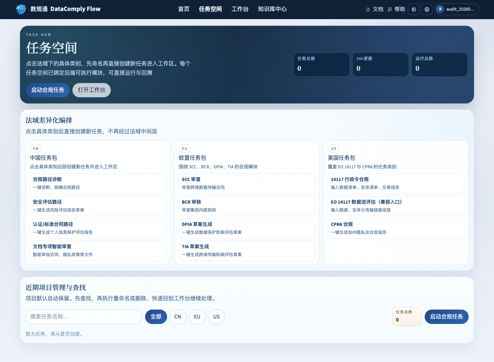
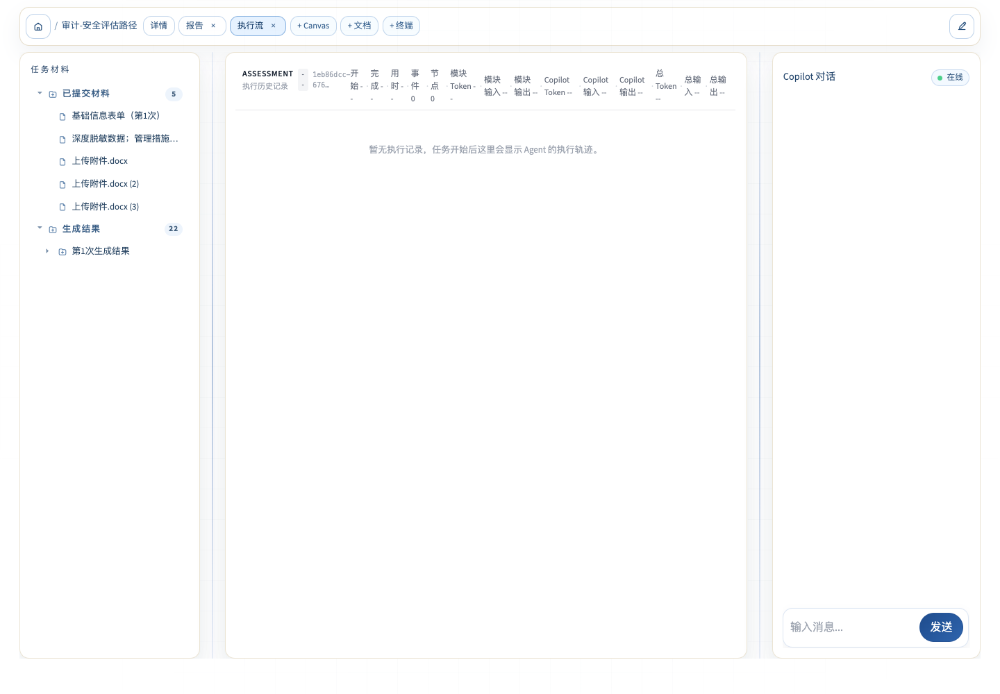
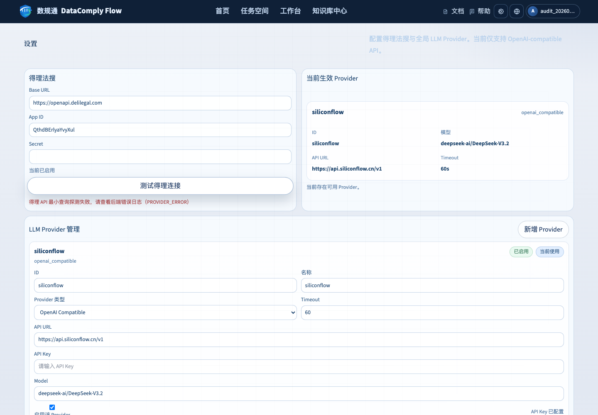
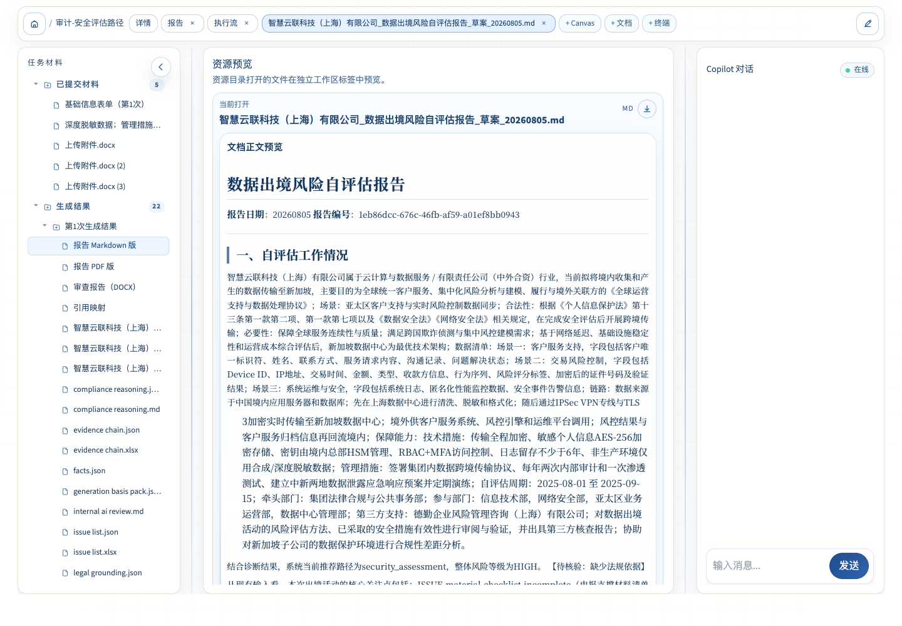

# DataComplyFlow 全功能运行验证与问题汇报

> 审计日期：2026-08-05（Asia/Shanghai）  
> 审计分支：`new`  
> 审计提交：`826e23d54d88c80f1b629d23c206fd3dccb7bdac`  
> 结论口径：本轮真实命令、真实浏览器、真实输出和当前代码优先；Mock/契约测试不等同于外部服务真实可用。  
> 截图目录：[`assets/DataComplyFlow_全功能运行验证_20260805/`](assets/DataComplyFlow_全功能运行验证_20260805/)

## 0. 执行结论

当前版本的本地规则、模板、文件生成和前后端基础链路可运行，自动化测试也已明显收敛；但本轮不能认定为“完整线上能力可用”。主要原因是：得理法搜与当前 LLM Provider 的真实连接探测均失败，安全评估虽生成 22 项产物，前端执行流却没有事件、节点、耗时和 Token；引用映射存在 7 条依据，但正文未形成引用索引；RAG 对中国法条命中较好，对 EU 精确条款与中文离题查询的控制仍有明显误差。

| 总体项目 | 本轮结果 | 结论 |
|---|---:|---|
| 后端 pytest | 528 passed，0 failed | 本地测试通过 |
| 前端 Vitest | 48 passed，0 failed | 前端单测通过 |
| 前端构建 | 成功，342 modules | 可构建 |
| CLI 功能案例 | 15/15 PASS | 规则/模板/降级链可运行 |
| 浏览器功能入口 | 11/11 均尝试；4 成功产出、7 失败 | UI 主链存在系统性断点 |
| 前端案例直投真实 API | 9/26 HTTP 200，17/26 失败 | 案例 JSON 与当前 Schema 大量漂移 |
| RAG/集成专项测试 | 31 passed | 契约与 Mock 层通过 |
| 得理法搜真实探测 | 失败：`PROVIDER_ERROR` | 未真实用通 |
| SiliconFlow 真实探测 | 失败：`PROVIDER_ERROR` | 本轮走降级输出 |
| 执行流/Token/耗时 | 安全评估显示空值 | 未正常呈现 |
| 引用跳转 | 7 条中仅 1 条 `can_jump=true` | 部分可跳，正文未串联 |

## 1. 分支拉取与工作区状态

执行了 `git fetch origin new`。对比结果为 `HEAD...origin/new = 1 0`，即本地比远端 `new` 多 1 个提交，远端没有需要拉取的新提交。`git pull --ff-only origin new` 因当前工作区存在未暂存改动且本机 Git 配置要求 rebase 而拒绝执行；为避免覆盖用户工作，没有 stash、reset 或还原任何文件。

当前工作区包含 97 个已跟踪删除项和 6 组未跟踪路径，主要表现为原 `docs/handoff/new/` 大批资料被删除、`resources/new/` 重新以未跟踪形式出现。这是尚未提交的资料迁移状态，不应误写为远端新增。

| 检查项 | 结果 | 判断 |
|---|---|---|
| 当前分支 | `new` | 正确 |
| 本地提交 | `826e23d...`，2026-08-04 | 当前审计基线 |
| 远端是否更新 | 否，远端落后本地 1 提交 | 无新提交可拉 |
| 工作区是否干净 | 否 | 不宜强拉/重置 |
| 资料迁移是否提交 | 否 | `resources/new/` 仍未跟踪 |

## 2. 功能与测试用例运行

### 2.1 自动化结果

后端执行 `UV_CACHE_DIR=/tmp/ai4law-uv-cache uv run --frozen pytest -q`：528 passed，1 个 Starlette/httpx 弃用警告，耗时 70.26 秒。

前端执行 `npm --prefix frontend test -- --run`：15 个测试文件、48 个测试全部通过；控制台中的 `chunk load failed` 是错误边界测试的预期输入，不是失败。`npm --prefix frontend run build` 构建成功。

CLI 执行 `python -m backend.tests.harness.runner all --no-llm`：15 个后端 harness 案例全部 PASS，覆盖 11 个模块。CLI 同时暴露当前模型初始化错误：SOCKS 代理环境缺少 `socksio`；`review` 的 5 次 LLM 调用全部 fallback，Token 为 0。因此这里的 PASS 表示该套离线规则/模板链成功，不表示前端案例、真实模型或浏览器链路成功。

| 模块 | CLI 案例数 | 浏览器代表性运行 | 主要结果 |
|---|---:|---|---|
| diagnosis | 3 | 成功 | 生成 2 项结果；无 Markdown/PDF 正文引用 |
| assessment | 2 | 成功 | 生成 22 项产物；执行流与 Token 空 |
| pipia | 1 | 成功 | 生成 4 项产物；执行流与 Token 空 |
| review | 1 | 失败 | 页面“最近一次运行失败”，0 产物；预置文档未进入上传队列 |
| eu_scc | 1 | 失败 | HTTP/Pydantic `Field required`，0 产物 |
| bcr | 1 | 失败 | 一键体验触发前端必填校验异常，0 产物 |
| dpia | 2 | 失败 | 一键体验触发前端必填校验异常，0 产物 |
| tia | 1 | 失败 | 一键体验触发前端必填校验异常，0 产物 |
| us_14117 | 1 | 失败 | “Invalid or missing required input”，0 产物 |
| cn_flow | 1 | 失败 | 页面“最近一次运行失败”，0 产物 |
| cpra | 1 | 成功 | 生成 6 项产物；执行流与 Token 空 |

前端 Vite 运行日志进一步定位了 3 个失败点：BCR 在 `ModuleRunPanel.tsx:802-804` 的 `buildBcrPayloadFrom()`、DPIA 在 `868-870` 的 `buildDpiaPayloadFrom()`、TIA 在 `998-1000` 的 `buildTiaPayloadFrom()` 抛出 “Invalid or missing required input”。这三项发生在 `runWithPayload()` 之前，因此不能归因于后端或外部 Provider。

浏览器结果截图：

| 模块 | 截图 |
|---|---|
| diagnosis | [表单](assets/DataComplyFlow_全功能运行验证_20260805/03-diagnosis-form.png) / [结果](assets/DataComplyFlow_全功能运行验证_20260805/04-diagnosis-result.png) |
| assessment | [真实预填](assets/DataComplyFlow_全功能运行验证_20260805/05-assessment-form.png) / [结果与执行流](assets/DataComplyFlow_全功能运行验证_20260805/06-assessment-result.png) / [Markdown](assets/DataComplyFlow_全功能运行验证_20260805/07-assessment-markdown.png) |
| pipia | [结果](assets/DataComplyFlow_全功能运行验证_20260805/08-pipia-result.png) |
| review | [失败：0 产物](assets/DataComplyFlow_全功能运行验证_20260805/09-review-result.png) |
| eu_scc | [失败：Field required](assets/DataComplyFlow_全功能运行验证_20260805/10-scc-result.png) |
| bcr | [失败：0 产物](assets/DataComplyFlow_全功能运行验证_20260805/11-bcr-result.png) |
| dpia | [失败：0 产物](assets/DataComplyFlow_全功能运行验证_20260805/12-dpia-result.png) |
| tia | [失败：0 产物](assets/DataComplyFlow_全功能运行验证_20260805/13-tia-result.png) |
| us_14117 | [失败：必填项缺失](assets/DataComplyFlow_全功能运行验证_20260805/14-14117-result.png) |
| cn_flow | [失败：0 产物](assets/DataComplyFlow_全功能运行验证_20260805/15-cn-flow-result.png) |
| cpra | [结果](assets/DataComplyFlow_全功能运行验证_20260805/16-cpra-result.png) |

### 2.2 前端 26 个案例直投真实 API

`frontend/src/lib/dev-test-cases.ts:1-17` 明确声称每个案例的 `payload` 是“完整 JSON payload，可直接 POST”。本轮将 26 个 payload 原样发送到 `frontend/src/api/modules.ts:80-165` 注册的同步端点，并使用真实鉴权用户。结果为 **9 成功、17 失败**。成功集中在 CPRA、EU SCC、DPIA 和 1 个 assessment；其他失败主要是案例字段已经落后于当前后端 Schema。

| 模块 | 案例 | HTTP | 产物数 | 结果/首要错误 |
|---|---|---:|---:|---|
| CPRA | TrendyGoods | 200 | 6 | 成功 |
| CPRA | DataFlow SaaS | 200 | 6 | 成功 |
| CPRA | FitLife AI | 200 | 6 | 成功 |
| diagnosis | 跨境优品 | 422 | 0 | `q6_scenario=business_operation`、`q7_receiver_type=affiliated_company` 不在枚举 |
| diagnosis | 前沿生命科技 | 422 | 0 | `scientific_research`、`academic_partner` 不在枚举 |
| diagnosis | 智造未来 | 422 | 0 | `technology_development`、`affiliated_company` 不在枚举 |
| assessment | 东方信托 | 422 | 0 | `legal_document_review` 等应为对象，案例仍给字符串 |
| assessment | 智慧云联 | 200 | 23 | 成功 |
| EU SCC | 基本 C2P | 200 | 6 | 成功 |
| EU SCC | 健康数据至印度 | 200 | 6 | 成功 |
| EU SCC | 多方加入/模块错误 | 200 | 6 | 成功 |
| BCR | GlobalTech | 422 | 0 | `review_items[].finding/legal_basis` 缺失 |
| BCR | HealthData | 422 | 0 | `review_items[].finding/legal_basis` 缺失 |
| BCR | CloudProcessors | 422 | 0 | `review_items[].finding/legal_basis` 缺失 |
| DPIA | AI 招聘 | 200 | 14 | 成功 |
| DPIA | 智慧城市 | 200 | 14 | 成功 |
| TIA | 基本 SCC | 422 | 0 | 附件 `file_role=tia_main_report`、`file_format=txt` 不在枚举 |
| TIA | BCR 至中国 | 422 | 0 | 同上 |
| PIPIA | 标准合同备案 | 422 | 0 | `company_profile.company_uscc` 等当前必填字段缺失 |
| PIPIA | 认证路径 | 422 | 0 | `company_profile.company_uscc` 缺失 |
| review | 隐私政策 | 400 | 0 | `No files uploaded for review task` |
| review | 标准合同 | 400 | 0 | `No files uploaded for review task` |
| CN Flow | 基础数据流 | 422 | 0 | `recipient_entities[].country_region` 缺失 |
| CN Flow | 受限主体 | 422 | 0 | `recipient_entities[].country_region` 缺失 |
| US 14117 | 基础交易 | 422 | 0 | `data_items[].data_item_name` 等缺失 |
| US 14117 | 受限主体 | 422 | 0 | `data_items[].data_item_name` 等缺失 |

这组结果与浏览器并不矛盾：浏览器表单构造器会把部分旧 `formDefaults` 转换成新请求，因此 diagnosis、PIPIA 的代表性 UI 运行可以成功；但文件头声称 payload 可直投的契约已经失真。相反，BCR/DPIA/TIA 直投中 DPIA 成功，但“一键体验”仍在前端构建阶段失败，说明 DPIA 后端和案例 payload 可用，坏点位于 UI preset 到 payload 的转换。

## 3. a. 目录、文件和输入输出冗余

本轮运行前后对比新增 1,960 个输出文件，`outputs/` 从约 1.0 GiB 增长到 1.1 GiB、共 42,022 个文件。大量模块每次运行保存全量 trace、中间 JSON、MD、XLSX、DOCX、PDF、ZIP；其中 ZIP 又包含已在外部目录单独保存的同批产物，属于明显的双重存储。

当前仓库还存在 728 个 `__pycache__` 目录和 7,723 个 `.pyc` 文件；`outputs/`、模板目录和资料包中存在 `.DS_Store`。这些均不应作为业务资产长期保留。`resources/templates/` 同一模板同时保存 DOCX 与 MD 有开发价值，但应明确一个权威源，否则会发生双向漂移。

思诚三组 ZIP 解压后共有 213 个文件，发现 8 组相同内容哈希。确认的重复包括：

- `个人信息保护影响评估报告（模板）.docx` 与 `(1).docx` 完全相同。
- `数据出境安全评估申报指南（第三版） (1).docx` 与 `(2).docx` 完全相同。
- 新加坡、日韩、港澳台、越南、马来西亚法规目录的 `.html` 与 `.md` 实际内容相同，仅扩展名不同。
- 多个 `.DS_Store` 内容相同。

| 冗余类别 | 数量/实例 | 影响 | 建议 |
|---|---:|---|---|
| 运行输出 | 42,022 文件、1.1 GiB | 仓库/磁盘快速膨胀 | 设置保留期，按 task_id 打包后清理散件 |
| 本轮新增输出 | 1,960 文件 | 单次全功能回归成本高 | 区分 debug 与交付产物 |
| Python 缓存 | 728 目录、7,723 `.pyc` | 非业务文件污染 | `.gitignore` + 定期清理 |
| ZIP 内重复哈希 | 8 组 | 重复入库/重复索引 | 入库前按 SHA-256 去重 |
| ZIP + 解压目录双层同名 | 三组资料均有外层/内层同名目录 | 路径冗长 | 解压时去除一层包装目录 |
| 模板 DOCX/MD 双源 | CN/EU/US 多组 | 结构漂移风险 | JSON schema/MD 为权威源，DOCX 自动生成 |
| assessment 输出包 + 散件 | 同一运行同时生成 ZIP 和 20+ 散件 | 重复占用 | ZIP 仅用于下载，不再长期复制保存 |

## 4. b. 中间过程、Token 与耗时

前端具备完整展示代码：`frontend/src/components/workspace/RunTranscript.tsx:25-97` 解析 Token 并渲染执行记录；`TraceRunHeader.tsx:55-85` 计算耗时；`TraceNodeView.tsx:42-49` 展示节点耗时与输入/输出 Token；`TaskEventBridge.tsx:184-185` 接收 `total_duration_ms`。

但真实安全评估运行中，页面显示“事件 0、节点 0、模块 Token --、总 Token --、用时 --、暂无执行记录”，与此同时左侧已经出现 22 项生成结果。说明前端组件不是缺失，而是任务执行事件没有被当前工作区正确关联、拉取或持久化。诊断模块的中间产物标签也均显示“当前模块尚未生成该中间产物”。

| 检查项 | 代码能力 | 真实运行 | 认定 |
|---|---|---|---|
| 执行事件 | 有组件和事件桥接 | 0 事件 | 异常 |
| 节点轨迹 | 有节点视图 | 0 节点 | 异常 |
| 总耗时 | 有 `durationMs` 计算 | `--` | 异常 |
| 模块 Token | 有 usage 汇总 | `--` | 异常 |
| Copilot Token | 有 usage 汇总 | `--` | 本轮未产生 |
| CLI Token | harness 可统计 | 0 | 因 `--no-llm`/fallback，符合本轮环境但不能验证真统计 |
| 中间 Fact/Issue/Evidence | 后端确实生成 JSON/XLSX | UI 主要以文件列表呈现，非过程视图 | 部分正常 |

## 5. c. RAG 功能

专项测试 31 项通过，覆盖 `backend/common/rag/`、DeliLegal 集成契约、文档审查 RAG provider、CPRA 法律检索与设置 API。代码主链在 `backend/common/rag/retriever.py:234-280`：本地哈希向量、词法检索、启发式重排与增强检索入口均存在；`retriever.py:446-460` 在结果不足且得理启用时追加远程法规结果。

本轮直接调用本地 RAG：

| 查询 | 前 3 条结果 | 判断 |
|---|---|---|
| `个人信息保护法第三十九条单独同意` | 命中模板第三十九条、个保法第三十九条、个保法第二十九条 | 中国精确法条可用，但模板排在法律原文前不理想 |
| `GDPR Article 35 DPIA` | 返回 3 个 EU supporting 文档段落，未直接命中 GDPR 第35条 | EU 精确条款召回不达预期 |
| `CPRA opt-out sale sharing` | 第一条命中 California CPRA/CCPA | 美国主题检索基本可用 |
| `今天天气怎么样` + jurisdiction=cn | 仍返回 DPA/安全评估办法 | 中文离题拦截失败 |

安全评估真实产物 `citation_map.json` 有 7 个引用项，说明 RAG/引用构造在后端确实运行；但正文引用索引为空，证明“检索成功”尚未等于“生成结果正确使用”。

| RAG 层级 | 状态 | 依据 |
|---|---|---|
| 索引加载 | 正常 | 实际查询返回多法域结果 |
| 中国法条召回 | 基本正常 | 精确命中 PIPL 第39条 |
| EU 精确法条 | 不稳定 | GDPR Article 35 未直达 |
| 美国主题召回 | 基本正常 | CPRA 首条命中 |
| 离题拒答 | 异常 | 中文天气问题仍返回法规 |
| 远程得理补充 | 本轮失败 | 设置页真实探测 `PROVIDER_ERROR` |
| 结果进入正文 | 异常/部分 | citation map 有数据，报告索引无数据 |

## 6. d. 得理法搜 API

设置页显示得理法搜“当前已启用”，即 App ID/Secret 已配置；真实点击“测试得理连接”返回“得理 API 最小查询探测失败（PROVIDER_ERROR）”。截图未暴露凭据。

真实实现位于 `backend/integrations/delilegal.py:11-20`，配置完整即 `enabled=true`；`22-56` 用“个人信息保护法”做最小探测；`58-105` 调用案例接口；`107-139` 调用法规接口。主要接入点如下：

| 模块/场景 | 何时调用 | 代码位置 | 本轮是否成功使用 |
|---|---|---|---|
| diagnosis session | 路径结论后补案例和法规 | `backend/services/diagnosis_session_service.py:282-303` | 未证明成功；探测失败 |
| assessment | 仅 HIGH/BLOCKER issue，每项 laws 3 + cases 2 | `backend/domains/cn/security_assessment/service.py:228-240` | 尝试条件具备，但结果无 Deli 成功标识 |
| 通用 RAG | 本地结果不足时补远程 law | `backend/common/rag/retriever.py:446-460` | 探测失败，实际回落本地 |
| 文档审查 | 高价值条款 `should_enrich` 时补案例 | `backend/domains/cn/document_review/rag_provider.py:116-132` | 失败时会把错误文字加入 citation，设计不佳 |
| BCR | 有专用 legal retriever | `backend/domains/eu/bcr_review/bcr_legal_retriever.py` | 未发现本轮成功远程结果 |
| DPIA/TIA/EU SCC/CPRA/EO14117/CN Flow/PIPIA | 主要依赖本地 RAG/各自规则 | 无直接业务级得理调用或只经公共检索间接触发 | 不应宣称已用上得理 |

结论：代码已经接入，配置也已启用，但本轮真实 API 没有用通。Mock 测试通过只证明错误分类、响应解析和注入契约成立。

## 7. e. 测试案例是否真实填入

前端测试案例只在 `VITE_ENABLE_DEV_ACCEL=true` 时启用。`frontend/src/components/workspace/ModuleRunPanel.tsx:307-342` 读取案例并把 `formDefaults` 合并进真实模块表单；assessment/review 还注入真实后端文件路径。各一键体验函数位于 `ModuleRunPanel.tsx:1521-1620`，流程为“合并预设 -> 构建该模块真实 payload -> `runWithPayload()`”，不是把一段假结果直接塞进页面。

浏览器网络与表单证据显示，diagnosis、US14117、CN Flow、CPRA 的案例选择后确实回填字段并向真实 API 提交；其中 diagnosis、CPRA 成功产出，US14117、CN Flow 提交后失败。安全评估案例真实生成了 5 项输入材料和 22 项输出。

但有两个口径风险：

1. 前端案例总数为 26 个，后端 harness 只有 15 个，二者不是同一套权威案例集；前端直投仅 9/26 成功。
2. 后端多数 `expected` 只断言 `result_not_empty`，对路径、风险、法条、引用、模板章节缺少强 oracle；“PASS”不能等同法律结论正确。

| 模块 | 前端案例数 | 后端 CLI 案例数 | 前端 payload 直投 | 主要问题 |
|---|---:|---:|---|---|
| diagnosis | 3 | 3 | 0/3 | 枚举漂移；UI builder 可转换部分字段 |
| assessment | 2 | 2 | 1/2 | 一例对象字段仍用字符串 |
| eu_scc | 3 | 1 | 3/3 | 直投正常，UI 一键体验仍失败 |
| bcr | 3 | 1 | 0/3 | review item schema 漂移 |
| dpia | 2 | 2 | 2/2 | 直投正常，UI 一键体验失败 |
| tia | 2 | 1 | 0/2 | 附件枚举漂移 |
| pipia | 2 | 1 | 0/2 | company profile 必填项漂移；UI builder 可转换 |
| review | 2 | 1 | 0/2 | payload 没有完成上传任务 |
| cn_flow | 2 | 1 | 0/2 | recipient schema 漂移，入口语义也混乱 |
| us_14117 | 2 | 1 | 0/2 | data item schema 漂移 |
| cpra | 3 | 1 | 3/3 | 直投正常 |
| 合计 | 26 | 15 | 9/26 | 需统一案例清单、Schema 和强预期 |

## 8. f. 引用跳转

安全评估 `citation_map.json` 本轮有 7 条引用：1 条精确条款可跳，6 条不可跳。可跳项为 `CN-LAW-001:4`；其余失败原因主要是 `article_not_found` 或 `article_not_unique`，只允许进入法规总览或站内搜索。

更严重的问题是正文明确写“（本报告未引用法规依据索引）”，但引用映射同时包含 7 条记录。报告正文中多处提到《个人信息保护法》《数据安全法》《网络安全法》，却标注“待核验：缺少法规依据”。这是引用构造、引用 marker 后处理和报告模板映射之间的断链。

| 检查项 | 数量 | 判断 |
|---|---:|---|
| citation map 总项 | 7 | 后端已检索/构造 |
| `can_jump=true` | 1 | 精确跳转覆盖率 14.3% |
| `can_jump=false` | 6 | 多数只能总览/搜索 |
| 正文脚注 | 0 | 未使用 |
| 正文引用索引 | 0 | 与 citation map 冲突 |
| `source_url` | 均为空 | 无法跳外部官方原文 |

体验不佳点：引用映射以原始 JSON 独立标签呈现；没有按“正文句子 -> 脚注 -> 条文原文”完成闭环；失败项只给机器字段；法规标题、条号和引用片段没有在正文高亮；缺少 PRD 要求的“复制引用”按钮与新规标签。

## 9. g. Markdown 结果问题分类

安全评估 Markdown 真实预览见下图：

| 类别 | 实际问题 | 严重度 | 示例/依据 |
|---|---|---|---|
| 引用 | 正文索引为空，citation map 有 7 条 | 高 | “本报告未引用法规依据索引” |
| 结论一致性 | 前文 overall risk HIGH，中段“综合风险等级 MEDIUM”，后文又 HIGH | 高 | 同一报告自相矛盾 |
| 事实重复 | 企业、目的、链路、措施整段在多个章节重复 | 中 | 第一章、第二章多次复述 |
| 表格渲染 | “项目内容企业名称...” 连成纯文本 | 中 | Markdown 表格未形成有效表格 |
| 换行破坏 | `TLS 1.3` 被拆为 `TLS` + 空行 + `3` | 中 | 文本清洗/自动换行错误 |
| 标题结构 | 多个章节更像纯文本段落，层级扫描性弱 | 中 | 浏览器正文预览 |
| 占位内容 | “该部分内容待补充”直接进入交付正文 | 中 | 其他情况章节 |
| 内部标记泄露 | `ISSUE-...`、`【待核验】`、`【已移除禁用措辞...】` 外露 | 高 | 不适合作为客户交付稿 |
| 法律表达 | 引用法律但仍统一标“缺少法规依据” | 高 | 法条绑定失败 |
| 降级说明 | 模型不可用说明正确，但只在末尾出现 | 低 | 应在报告顶部醒目标识 |
| 免责声明 | 有“仅供参考”，但未完全匹配 PRD 固定文案/三处展示 | 中 | PRD 5.1.1 |
| 文件命名 | 日期无分隔，中文/英文/下划线/空格并存 | 低 | 输出列表 |

按模块观察，diagnosis 只生成 HTML，不提供统一 Markdown/PDF 审阅；assessment 的 Markdown 问题最多且可复现；其他模块虽然可生成 Markdown，但仍普遍存在固定模板段落、降级文本、内部字段名和引用稀疏问题。建议建立统一 Markdown lint：标题层级、表格、空章节、内部标记、风险等级唯一性、脚注存在性、免责声明、禁用措辞七类硬门禁。

## 10. h. 与思诚模板/需求的匹配

本轮以 2026-08-04 21:00 的《数规通（DataComplyFlow）需求说明书》作为最新需求口径。文档版本记录署名“王思成”，V0.1.0，2026-07-21。

### 10.1 已匹配

| 要求 | 当前实现 | 结论 |
|---|---|---|
| 中/欧/美三法域功能入口 | 11 个任务入口 | 匹配 |
| 中国五步路径诊断 | diagnosis 决策树与表单 | 基本匹配 |
| 规则优先、AI辅助 | CLI 无 LLM 仍可出结果 | 匹配 |
| 自评估报告官方章节 | `official_risk_self_assessment_template.md` 含三大章及六小节 | 结构匹配 |
| 多格式导出 | assessment 等有 MD/DOCX/PDF/XLSX/JSON/ZIP | 匹配 |
| 风险项、整改建议 | 多模块均有 | 匹配 |
| 草稿/人工复核提示 | 报告末尾有提示 | 部分匹配 |
| 操作 trace/中间产物 | 后端文件确实生成 | 后端匹配，前端呈现不匹配 |

### 10.2 未匹配或只部分匹配

| 思诚要求 | 当前差距 | 结论 |
|---|---|---|
| 每条结论绑定“法规名+条号+摘要” | 正文无脚注，引用映射未串联 | 不匹配 |
| 法条引用错误率 0 | 本轮出现《网络安全法》第4条关联“敏感个人信息定性”等可疑映射 | 未达到可验收状态 |
| Word/PDF 固定水印与完整免责声明 | 部分输出有简化免责声明，未证明三处固定显示和不可移除 | 部分匹配 |
| 法条高亮、复制引用、新规标签 | 前端未见完整控件 | 不匹配 |
| 人工复核六类条件自动冻结 | 当前主要是提示，不是统一冻结队列 | 不匹配 |
| 置信度低于 90% 自动复核 | 未见统一实现 | 不匹配 |
| WORM 日志、至少 3 年、操作 IP/规则版本/复核意见 | 当前 trace/数据库不是 WORM 完整账本 | 不匹配 |
| 文书 10 秒内生成且界面统计 | 本轮多数可完成，但前端耗时为空，无法验收 | 不可验证 |
| 100 个律师核验案例、准确率 >=95% | 当前后端仅 15 个 CLI 案例，且 oracle 弱 | 不匹配 |
| PIA 按附件逐字模板 | 现有 PIPIA 模板/输出未证明逐字一致 | 部分/未验证 |
| EU SCC/BCR/DPIA/TIA 官方模板强制要素 | 有模块模板，但当前 `resources/templates/eu` 只有 BCR、TIA 两份 | 部分匹配 |
| EO14117/CPRA 完整文书 | 有简化模板和结果 | 部分匹配 |
| “逻辑说明 + 文书草案”双输出 | assessment 有内部分析及正文，模块不统一 | 部分匹配 |

当前模板覆盖也不完整：CN 有自评估官方模板；EU 仅 BCR、TIA；US 有 CN Flow、CPRA、EO14117；缺少统一可见的 diagnosis、PIPIA、document review、EU SCC、DPIA 权威模板文件。`resources/templates/cn/2.2_risk_assessment_template_v0.md` 的 7 节结构与官方自评估模板三大章并不一致，应停止双源并存。

| 模板检查 | 匹配数 | 部分匹配 | 缺失/冲突 |
|---|---:|---:|---:|
| 11 个功能入口对应权威模板 | 6 | 1 | 4 |
| assessment 官方结构 | 1 | 0 | 另有 1 份冲突 v0 模板 |
| 引用/免责声明/水印要求 | 0 | 多数模块 | 全平台统一能力缺失 |
| “逻辑+草案”双输出 | assessment 较完整 | 其他生成模块 | diagnosis/review 不统一 |

## 11. i. 思诚资料更新与新增文件

`resources/new/` 当前共 8 个顶层文件，约 87 MiB；全部尚未被 Git 跟踪。最新文件是 2026-08-04 21:00 的需求说明书，其次是 2026-08-04 14:15 的《数据出境合规实务手册》。

| 文件 | 修改时间 | 大小 | 内容与影响 |
|---|---|---:|---|
| 《数规通（DataComplyFlow）需求说明书》.docx | 2026-08-04 21:00 | 727,719 B | 最新统一 PRD/验收口径，新增强约束最多 |
| 167、数据出境合规实务手册.pdf | 2026-08-04 14:15 | 1,777,474 B | 74 个实务问答，可补中国知识库 |
| 数规通黄金标准与种子案例.zip | 2026-07-31 | 3,953,500 B | 10 类任务、每类多案例及测试结果，现有 harness 尚未全量吸收 |
| 知识库补充.zip | 2026-07-30 | 42,505,970 B | 新增新加坡、日韩、港澳台、越南、马来西亚法规 |
| 数据分级分类指南 GB/T 43697-2024.pdf | 2026-07-26 | 532,354 B | 数据分类分级国家标准 |
| 敏感个人信息处理安全要求 GB/T 45574-2025.pdf | 2026-07-23 | 397,992 B | 2025-11-01 生效，需做 effective-date 管理 |
| 功能路径/reference/流程/测试案例.zip | 2026-07-23 | 41,477,101 B | 110 entries，覆盖中/欧/美路径、Reference、测试案例 |
| 合规路径诊断说明.docx | 2026-07-23 | 30,861 B | diagnosis 路径和 Reference 说明 |

三组 ZIP 统计：功能路径包 90 个文件，黄金标准包 56 个文件，知识库补充包 116 个文件；合计解压后的去目录文件数为 213。黄金标准包包含中国任务1-4、欧盟任务5-8、美国任务9-10的种子结果，但当前产品入口与后端 harness 只覆盖其中一部分命名体系。例如黄金标准中的“GDPR 合规诊断”“BD ROD 判断”没有独立产品入口；当前产品的 DPIA/BCR 等又未完全对应黄金标准任务编号。

| 新增类别 | 新增情况 | 当前接入状态 |
|---|---|---|
| PRD/验收标准 | 新增 1 份最新统一文档 | 尚未转为自动验收规则 |
| 中国标准/手册 | 3 份 | 未证明全部重建索引 |
| 多法域知识库 | 5 个地区组、100+ 文件 | `resources/new` 未跟踪，未正式入库 |
| 黄金标准/种子案例 | 10 类任务、多案例 | 当前 harness 仅 15 个弱 oracle 案例 |
| 功能说明/预期输出 | 中欧美 11 个产品方向 | 需要映射到模块 ID、模板 ID、案例 ID |
| 重复资产 | 8 组相同哈希 | 入库前必须去重 |

## 12. 问题优先级与代码定位

| 优先级 | 问题 | 代码/证据位置 | 建议验收条件 |
|---|---|---|---|
| P0 | 引用映射有数据但正文无引用 | `backend/domains/cn/security_assessment/report_renderer.py:370-412`；本轮 citation map | 正文每个法律结论有可跳脚注，索引与 map 数量一致 |
| P0 | 同一报告风险等级 HIGH/MEDIUM/HIGH 冲突 | assessment Markdown 截图/产物 | 报告只允许一个 canonical overall risk |
| P0 | 得理与 LLM 配置启用但真实探测失败 | 设置页截图；`backend/integrations/delilegal.py:22-56` | 两项探测均成功并记录 latency/result_count |
| P0 | 前端案例直投 17/26 失败、UI 7/11 失败 | `dev-test-cases.ts:1-17`、`ModuleRunPanel.tsx:307-342, 1521-1620` | 26 个 payload 全部 2xx；11 个 UI 一键入口全部产出 |
| P1 | 执行流事件/节点/Token/耗时全空 | `RunTranscript.tsx:25-97`、`TaskEventBridge.tsx:184-185` | 每次任务至少有 start/end、节点、duration；有 LLM 时有 usage |
| P1 | RAG EU 精确条款与中文离题失败 | `backend/common/rag/retriever.py:256-280` | GDPR Article 35 首屏命中；中文离题返回空 |
| P1 | 测试案例前后端两套、oracle 弱 | `dev-test-cases.ts:1381-1395`；`backend/tests/*/cases` | 单一 case_id；法条/路径/风险/章节/引用强断言 |
| P1 | Markdown 内部 ISSUE/待核验标记外泄 | assessment fallback generator `chapter_generator.py:431-520` | 外部稿禁止内部 ID，待核验项进入专门附录 |
| P2 | 运行输出、缓存、ZIP 散件冗余 | `outputs/` 42,022 文件 | 明确保留期和交付/调试分层 |
| P2 | 权威模板不全且 assessment 双模板冲突 | `resources/templates/` | 每模块一个 schema/模板权威源 |
| P2 | 新资料未跟踪且未形成入库清单 | `resources/new/` | hash manifest、来源、版本、生效期、索引状态完整 |

## 13. 最终统领表

| 用户要求 | 完成情况 | 核心结论 |
|---|---|---|
| a. 冗余目录/输入输出 | 已统计 | 输出 1.1 GiB；缓存和 ZIP/散件重复明显；资料包 8 组重复哈希 |
| b. 中间过程/Token/time | 已运行并截图 | 前端代码具备，真实安全评估全部空值，异常 |
| c. RAG | 已做测试与实查 | CN/US 基本可用；EU 精确条款、中文离题失败；正文使用断链 |
| d. 得理 API | 已真实探测与代码映射 | 已配置、代码已接入，但真实调用失败，不能宣称已用通 |
| e. 测试案例真实填入 | 已验证 | 会真实回填/调用；但前端 26 例仅 9 例可直投，UI 仅 4/11 代表性运行产出 |
| f. 引用跳转 | 已检查 | 7 条仅 1 条可精确跳，正文 0 脚注，体验不合格 |
| g. Markdown 问题 | 已分类 | 引用、风险冲突、重复、表格、换行、内部标记等 12 类 |
| h. 模板匹配 | 已按最新 PRD 对照 | 功能入口基本匹配；引用、复核、WORM、模板完整度未匹配 |
| i. 思诚文档更新 | 已清点 | 8 个顶层文件、约87 MiB；最新 PRD 2026-08-04；均未跟踪/正式入库 |

最终认定：当前版本是“后端 harness 可运行、部分模块可演示”的开发基线，尚不适合作为稳定的全功能比赛演示，更不适合作为“已通过思诚 PRD 验收的可交付系统”。下一轮应优先修复案例/Schema 漂移和 7 个 UI 入口，再修复引用闭环、真实 Provider 健康、执行流统计和测试强 oracle，最后进行模板逐字对齐与新增知识库正式入库。
