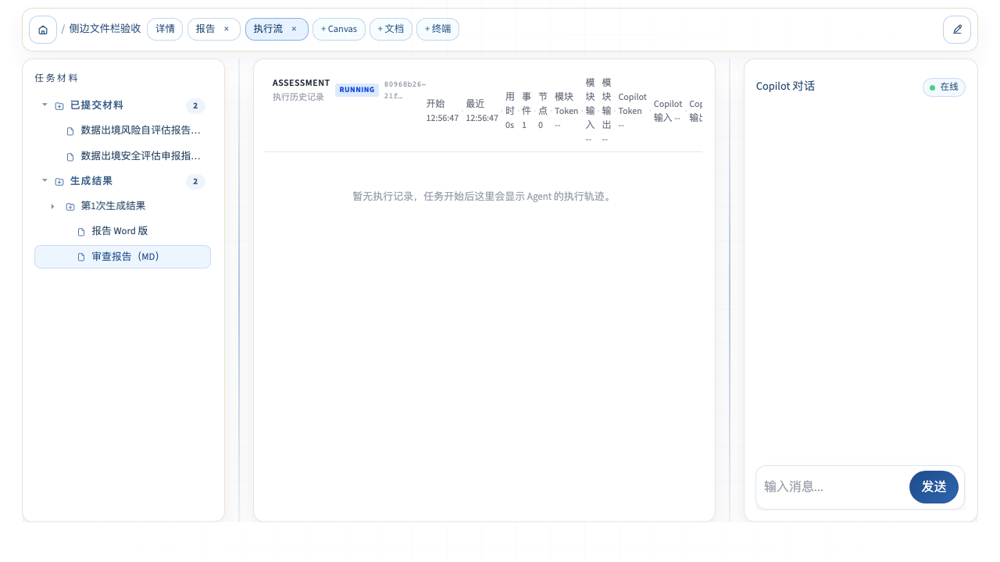

# DataComplyFlow 侧边文件栏架构改造本地验收

> 日期：2026-08-08
>
> 范围：本地代码、本地自动化测试、本地 Chromium 运行验证
>
> 远程状态：未部署、未测试，等待用户同意

## 一、验收结论

侧边文件栏的核心改造已经在本地完成：输入区只显示真实文件，不再显示表单 JSON；输出区只显示报告和明确允许的交付文件，内部编译产物默认隐藏；原来集中在 `ResourcePanel.tsx` 的输入扫描、输出过滤、命名和树构建已拆到独立功能目录，并经过单元测试、全量前端测试、生产构建和真实 Chromium 验证。

本轮没有假装完成输入文件预览。现有 `/api/v1/artifacts/preview` 要求文件位于允许目录且在数据库中登记，而开发预置文件及 v0 上传文件不一定满足该条件，直接保留点击会出现 403。因此输入文件当前只展示名称；输出报告仍可点击预览。统一输入预览授权应作为后续单独任务处理。

| 验收项 | 结果 | 结论 |
|---|---:|---|
| 职责拆分 | 通过 | 展示组件不再承载输入扫描、过滤、命名和树构建 |
| 输入真实性 | 通过 | 只从文件字段提取，不再把表单、说明文字、URL、法规索引当文件 |
| 输出去冗余 | 通过 | citation map、document IR、facts、issue/evidence list 等不展示 |
| 旧流程清理 | 通过 | `input-form` 类型、创建、点击和预览分支均已删除 |
| 自动化测试 | 通过 | 前端 121 通过、2 跳过；专项测试 8/8 通过 |
| 生产构建 | 通过 | `tsc -b && vite build` 成功 |
| 浏览器验证 | 通过 | Chromium E2E 1/1 通过，控制台无错误 |
| 远程部署 | 未执行 | 遵守“本地完成后等待同意”的要求 |

## 二、实际代码结构

```text
frontend/src/features/resource-explorer/
├── contracts.ts          # 层间稳定类型
├── config.ts             # 文件字段、产物白名单、显示名等纯配置
├── file-path.ts          # 文件名、扩展名、名称清理
├── input-resources.ts    # 输入文件提取、去重和显示条目生成
├── output-artifacts.ts   # 输出过滤、命名和运行批次分组
├── path-tree.ts          # 扁平路径转目录树
└── resource-explorer.test.ts
```

依赖方向为：

```text
ResourcePanel（展示）
        ↓
resource-explorer 纯函数
        ↓
contracts / config
```

没有让公共能力反向依赖 `ResourcePanel`、`WorkspaceShell` 或具体业务模块。

## 三、关键改动与依据

### 3.1 输入文件

- `input-resources.ts:21`：统一入口 `collectUserInputFiles()`。
- `input-resources.ts:63-76`：只识别 `attachments`、`uploaded_files` 和明确的 `*_files` 字段。
- `input-resources.ts:9-14`：排除 HTTP URL，仅接受配置允许的用户文件扩展名。
- `input-resources.ts:93-125`：跨运行去重，并排除已经属于输出产物的路径。
- `ResourcePanel.tsx:168-186`：输入文件只展示，不调用尚未统一授权的预览接口。

这解决了旧实现“递归扫描任意字符串，只要像路径就当成输入文件”的误识别问题。

### 3.2 输出文件

- `config.ts:30-43`：采用产物类型白名单，未知类型默认不展示。
- `config.ts:48-65`：对内部产物名称进行第二层防御性过滤。
- `output-artifacts.ts:17-28`：统一完成去重、类型判断、扩展名判断和内部产物过滤。
- `output-artifacts.ts:30-52`：统一中英文显示名。
- `output-artifacts.ts:54-97`：按运行批次组织输出，并处理同名文件。

采用“白名单默认拒绝”而不是只维护黑名单，原因是以后新增内部 XLSX/MD 时不会自动泄露到用户界面。

### 3.3 展示组件与旧流程

- `ResourcePanel.tsx:2-5`：只导入资源浏览器契约和纯函数。
- `ResourcePanel.tsx:52-69`：输入、输出和目录树均由功能层生成。
- `ResourcePanel.tsx:120-130`：只有允许展示的输出产物可以触发资源打开。
- `WorkspaceShell.tsx`：已删除 `input-form` 和 `input-file` 的旧预览分支。

`ResourcePanel.tsx` 从 616 行降至 221 行。删除的是已经被公共模型替代的旧逻辑，不是注释保留；避免形成两套实现继续漂移。

## 四、测试证据

### 4.1 纯函数与组件测试

```bash
npm test -- --run \
  src/features/resource-explorer/resource-explorer.test.ts \
  src/components/workspace/ResourcePanel.test.tsx
```

结果：2 个测试文件、8 项测试全部通过。

覆盖内容：

- DOC/DOCX/PDF/PNG/XLSX/CSV/MD/JSON 等真实输入；
- 说明文字 `report.pdf`、外部 URL、source registry 不误识别；
- 输入路径和输出路径去重；
- 表单 JSON 不再出现；
- 未知产物类型默认隐藏；
- citation map、document IR、facts、issue list 等内部产物隐藏；
- 报告 DOCX/PDF/MD/ZIP 和明确允许的 XLSX 展示；
- 多批次目录、同名文件编号、目录树排序；
- 点击可见输出会传递正确 artifact。

### 4.2 全量前端测试

```bash
npm test
```

结果：24 个测试文件通过、1 个文件按既有配置跳过；121 项通过、2 项跳过。测试日志中的 `chunk load failed` 是错误边界测试主动制造的异常，不是本轮运行故障。

### 4.3 生产构建

```bash
npm run build
```

结果：TypeScript 项目构建和 Vite 生产打包均通过，共转换 352 个模块。

### 4.4 Chromium 端到端测试

```bash
npx playwright test tests/e2e/resource-explorer.e2e.ts --project=chromium
```

结果：1/1 通过。真实浏览器中观察到：

- “已提交材料”计数为 2，只显示真实预置文档；
- “生成结果”计数为 2，只显示 Markdown 与 Word 报告；
- `citation_map.json`、`facts.json` 不在 DOM 中；
- 输出目录可以展开；
- 输出报告按钮可见；
- 浏览器控制台错误数为 0。



## 五、Git 存档

| 提交 | 内容 |
|---|---|
| `38d3cc3` | 存档原始侧边文件栏改造方案 |
| `9f20f59` | 新增资源浏览器契约、配置、纯函数和单元测试 |
| `425f533` | `ResourcePanel` 接入新模型并删除旧表单预览流程 |
| `51ddf8f` | 修复已有引用联合类型错误，使完整构建可继续 |
| `81591bb` | 开发预置改用真实业务文档，去掉 sample 占位文件 |

## 六、尚未完成但没有伪装完成的事项

| 后续事项 | 当前原因 | 建议做法 |
|---|---|---|
| 输入文件点击预览 | v0 上传和开发预置没有统一的数据库授权记录 | 统一上传登记和资源授权后，再开放点击 |
| 产物与运行记录精确绑定 | 当前 `OutputArtifact` 没有 `runId`，只能按时间归入批次 | 后端/前端契约增加 `runId`，历史数据才用时间兜底 |
| 后端 outputs/internals 物理分离 | 涉及所有模块输出路径和下载接口，不宜与前端重构混改 | 单独迁移并保留兼容读取期 |
| 自动折叠体验 | 不影响真实性和核心功能 | 在资源数量及窗口宽度规则明确后单独实现 |
| 远程环境验证 | 用户要求本地完成后等待同意 | 获得明确同意后再部署和复验 |

## 七、最终判断

本轮已完成“侧边文件栏的核心架构与用户可见行为”本地验收，可以作为本地阶段成果存档；整个原方案暂时仍放在 `status/todo/`，因为输入预览授权、`runId` 精确绑定、后端产物物理分离和远程复验尚未完成。这样既不会把已完成工作说成未完成，也不会把未完成部分包装成完成。
