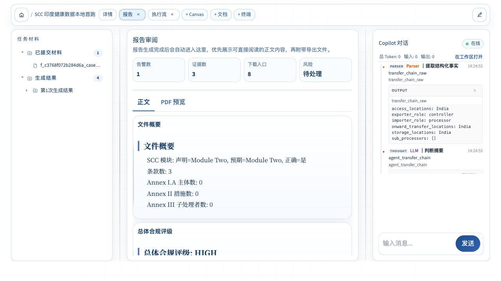
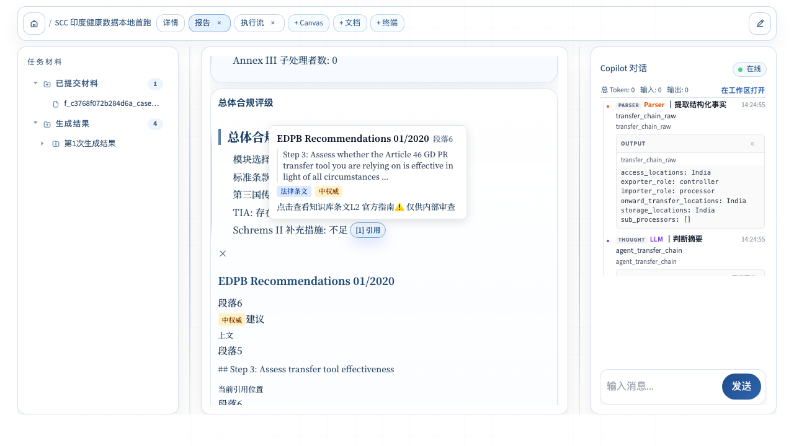
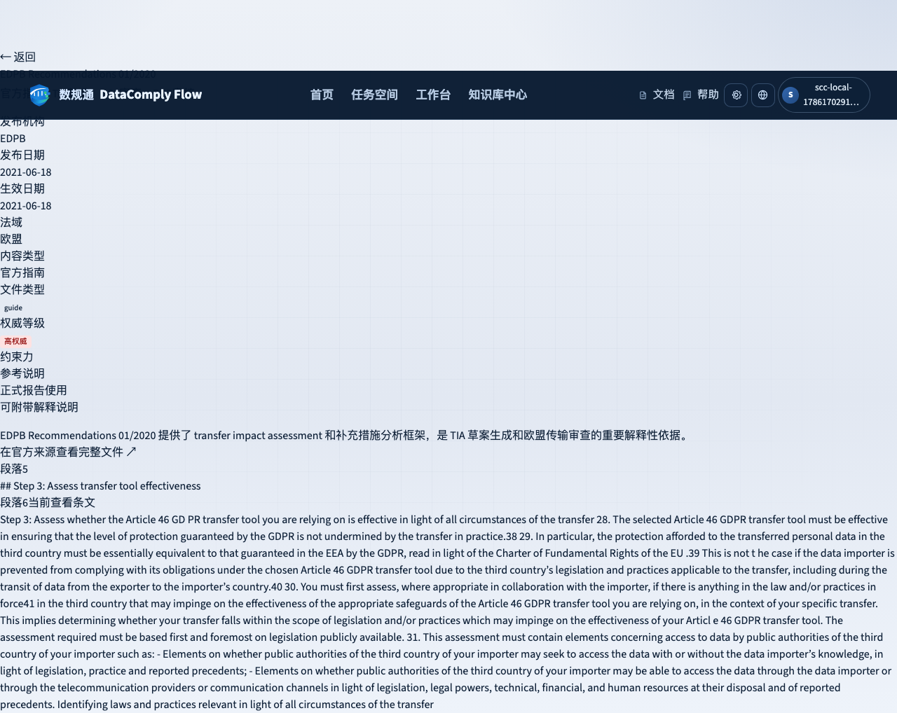
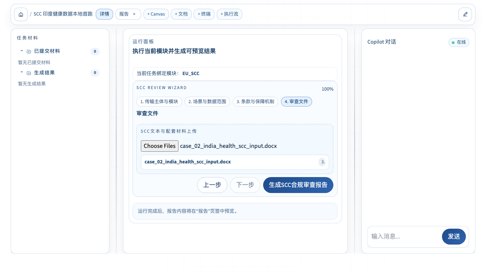

# DataComplyFlow SCC 本地完整首跑验收报告

> 验收日期：2026-08-08
>
> 验收模块：`eu_scc`
>
> 验收环境：本地 `new` 分支；未连接、未部署远端
>
> 验收层次：旧流程 no-LLM、Schema-first no-LLM、Schema-first live LLM、本地 HTTP、真实浏览器

## 1. 一句话结论

**SCC 已完成本地完整首跑：真实案例 DOCX 确实进入核心审查，旧流程与 Schema-first 新流程业务结论一致，live 模型 27/27 断言通过，浏览器上传、报告展示、引用抽屉和知识库“段落6”跳转全部通过；本轮未做任何远端部署。**

## 2. 最终验收总表

| 验收层 | 案例 | 结果 | 时间 | 模型调用 / token | 核心证据 |
|---|---|---:|---:|---:|---|
| 旧流程 no-LLM | 最小案例 | PASS，18/18 | 1.55 秒 | 0 / 0 | 关闭 Schema-first 后仍可生成完整产物 |
| 旧流程 no-LLM | 印度健康数据复杂案例 | PASS，27/27 | 0.42 秒 | 0 / 0 | HIGH、8 个发现、真实 DOCX、批注版 DOCX |
| Schema-first no-LLM | 最小案例 | PASS，18/18 | 1.57 秒 | 0 / 0 | 多出 DocumentIR，无阻断诊断 |
| Schema-first no-LLM | 印度健康数据复杂案例 | PASS，27/27 | 0.41 秒 | 0 / 0 | 旧新流程业务结果一致，3 条脚注可跳转 |
| Schema-first live LLM | 印度健康数据复杂案例 | PASS，27/27 | 172.47 秒 | 5 / 9,659 | 38 个事件，0 回退，0 错误 |
| 本地 HTTP + Chromium | 手填表单并上传复杂案例 DOCX | PASS | 后端 1.20 秒；浏览器用例 8.7 秒 | 0 / 0 | 上传、提交、轮询、CitationMap、条文接口全部 200 |

完整运行证据位于 `complete_run/`；浏览器截图与网络日志位于 `browser/`。

## 3. 案例真实性与输入证据

### 3.1 权威来源

复杂案例来自：

`resources/new/数规通功能路径描述（含reference）、流程描述、测试案例/欧盟数据出境路径/任务1：“SCC审查”路径描述及测试案例/“SCC审查”测试案例及预期输出.docx`

来源文档 SHA-256：

`33258f76485ae50d4211f785ac97ce4c4e7545e902ef63390a94f11fe9ba110c`

### 3.2 可执行测试输入

测试专用 SCC 文件：

`backend/tests/eu_scc/fixtures/case_02_india_health_scc_input.docx`

文件 SHA-256：

`db5a1faf81fa7849fdf21fbbc5b271b5c4cab2fb48449d539fd85467d3ff1d34`

对应强断言案例：

`backend/tests/eu_scc/cases/02_india_health_uploaded.json`

该案例不是随意编造。测试文件内容由来源文档中的“案例二场景说明 + 案例二提交审查 SCC 文本”生成；案例 JSON 同时记录来源路径、来源哈希、测试文件哈希和 27 个结果断言。

### 3.3 真实进入核心审查的依据

`backend/domains/eu/scc_review/service.py` 的 `generate_report()` 在解析前调用 `_use_uploaded_scc_document()`。当上传 DOCX 可解析且正文长度合格时，解析出的全文会替换表单拼接的 `scc_text`，并记录：

```text
已使用上传 SCC 文档作为核心审查文本
source_path: ...case_02_india_health_scc_input.docx
```

浏览器最终运行 manifest 还记录了服务器实际保存的上传文件：

```text
storage/uploads/f_..._case_02_india_health_scc_input.docx
```

因此，本轮不是“附件名出现在列表里，但业务仍审查表单文本”。

| 输入核验项 | 结果 | 依据 |
|---|---:|---|
| 来源可追溯 | 通过 | 来源路径与 SHA-256 已写入案例 |
| 测试文件内容可复现 | 通过 | fixture SHA-256 固定 |
| 浏览器实际上传 | 通过 | `/api/v0/files/upload` 返回 200 |
| 后端实际解析上传正文 | 通过 | trace 的 `intermediate` 事件与 source_path |
| 业务断言真实执行 | 通过 | live 运行 27/27，而非只校验 HTTP 状态 |

## 4. 业务结果与新旧流程一致性

复杂案例的旧流程和 Schema-first 新流程均得到：

- SCC 模块：`Module Two`，模块判断正确；
- 总体评级：`HIGH`；
- 章节数：4；
- 发现项：8；
- 关键问题：Clause 15 通知义务被削弱、健康数据未按特殊类别声明、Annex II/TOM 不足、印度传输缺少 TIA 或补充措施；
- 输出：Markdown、DOCX、PDF、findings、规则结果、CitationMap、批注版 DOCX；
- Schema-first 额外输出：DocumentIR。

| 对照项 | 旧流程 | Schema-first | 结论 |
|---|---:|---:|---|
| 复杂案例断言 | 27/27 | 27/27 | 一致 |
| 总体评级 | HIGH | HIGH | 一致 |
| 模块判断 | Module Two 正确 | Module Two 正确 | 一致 |
| 发现项 | 8 | 8 | 一致 |
| 章节 | 4 | 4 | 一致 |
| 正文脚注 | 3 | 3 | 一致 |
| 可跳转引用 | 3/3 | 3/3 | 一致 |
| DocumentIR | 无 | 有 | 符合迁移设计 |
| 批注 DOCX | 有 | 有 | 一致 |

结论：Schema-first 没有改变 SCC 的业务判定，只增加结构化中间表示和编译门禁；关闭开关后旧路径仍可恢复。

## 5. RAG 与引用闭环

### 5.1 RAG 正常的依据

RAG 不能仅以“检索函数被调用”判定正常。本轮同时核对了：

1. trace 中存在 `retrieval_hits`；
2. CitationMap 最终只保留与 SCC 核心问题有关的 3 条依据；
3. 正文实际出现 `[1]`、`[2]`、`[3]`；
4. 3 条引用都能映射到唯一知识库位置；
5. Chromium 实点 `[1]` 后，条文接口返回 200，页面显示 EDPB 原文。

### 5.2 最终 3 条引用

| 脚注 | 来源 | 位置 | 用途 | `can_jump` |
|---:|---|---|---|---:|
| 1 | EDPB Recommendations 01/2020 | 段落6 / Step 3 | 传输工具有效性与补充措施 | true |
| 2 | Commission Implementing Decision (EU) 2021/914 | 段落27 / Clause 15 | 政府访问请求通知义务 | true |
| 3 | Commission Implementing Decision (EU) 2021/914 | 段落26 / Clause 14 | 第三国法律与持续合规评估 | true |

正文法律分析仍引用 GDPR Article 46、Article 9、Article 32 和 Schrems II；CitationMap 的 3 个跳转对象则使用本地已唯一入库、可精确定位的官方文件，不用无关条文凑数量。

### 5.3 浏览器真实跳转







浏览器最终 URL：

`/knowledge/laws/EU-GUIDE-002?article=段落6`

| 引用闭环检查 | 结果 | 证据 |
|---|---:|---|
| CitationMap API | 通过 | 200，3 条脚注 |
| 正文脚注渲染 | 通过 | `[1] 引用` 为可点击按钮 |
| 引用抽屉 | 通过 | 显示“当前引用位置”和段落6原文 |
| 知识库页面 | 通过 | 显示“当前查看条文”和 Step 3 原文 |
| 定位用语 | 通过 | “段落6”不再误写成“第段落6条” |

## 6. 中间过程、模型、token 与时间

最终 live 运行：

`runs/eu_scc/20260808_135621_365701_02_india_health_uploaded`

| 指标 | 实际值 |
|---|---:|
| Provider | SiliconFlow，OpenAI-compatible |
| Model | `deepseek-ai/DeepSeek-V3.2` |
| API Key | 已配置；证据中只记录布尔值和指纹，不保存明文 |
| 总耗时 | 172,472.63 ms |
| LLM 调用 | 5 |
| 输入 token | 6,155 |
| 输出 token | 3,504 |
| 总 token | 9,659 |
| trace 事件 | 38 |
| fallback | 0 |
| error | 0 |
| 断言 | 27/27 |

trace 覆盖：上传正文采用、文档解析、传输链、规则引擎、Clause 语义分析、TIA 有效性、事实、问题、RAG 命中、证据、上下文、4 次主章节模型调用、证据复核、整改 Agent 以及最终结果。

这里需要区分两类时间：

- live harness 172.47 秒：包含 5 次真实模型调用，用于验证内容生成、token 和完整 trace；
- 浏览器本地后端 1.20 秒：明确禁用模型，只验证上传、HTTP、页面展示和引用点击，防止为重复验证再次消耗模型。



| 可观测性检查 | 结果 |
|---|---:|
| token 有真实 provider 依据 | 通过 |
| 总耗时写入 manifest | 通过 |
| Agent 5/6 进入 trace | 通过 |
| 回退次数可见 | 通过，最终为 0 |
| 浏览器执行流可见 | 通过 |
| 浏览器控制台错误或警告 | 0 |

## 7. 产物完整性

live 最终输出共 8 项：

| 角色 | 文件 | 大小 | 核验结果 |
|---|---|---:|---|
| Markdown | SCC 审查报告 `.md` | 12,937 B | 有 4 章、结论、发现和脚注 |
| DOCX | SCC 审查报告 `.docx` | 41,822 B | 有效 OOXML，可打开 |
| PDF | SCC 审查报告 `.pdf` | 16,915 B | 5 页，可打开 |
| findings | `findings.json` | 5,662 B | 8 条发现 |
| rule result | `rule_engine_result.json` | 19,723 B | 规则结果完整 |
| CitationMap | `citation_map.json` | 16,059 B | 3 条脚注，3/3 可跳转 |
| DocumentIR | `document_ir.json` | 29,491 B | 4 个 section，无阻断诊断 |
| 批注版 DOCX | SCC 批注修订版 `.docx` | 41,108 B | 基于上传 DOCX 生成 |

SCC 当前没有 ZIP 输出包。这是现有产品输出边界，不是运行漏文件；如以后要求“一键下载全部”，应先定义 SCC 包清单，再单独实现，不能临时把运行目录打包冒充产品能力。

| 产物维度 | 结果 |
|---|---:|
| 主报告三格式 | 通过 |
| 结构化结果 | 通过 |
| Schema-first IR | 通过 |
| 上传文件批注版 | 通过 |
| CitationMap | 通过 |
| ZIP | 未定义，不纳入本轮通过条件 |

## 8. 本轮发现并修复的问题

### 8.1 上传文件原来没有进入核心审查

- 表现：`uploaded_files` 只参与附件摘要或批注文件选择，核心解析仍可能使用表单拼接的 `scc_text`。
- 修复：解析前选取真实 DOCX，成功解析后替换核心审查文本，并记录 source_path 与 text_length。
- 防回归：复杂案例断言上传文件中的印度、健康数据、Clause 15 修改和缺少补充措施必须进入结果。

### 8.2 SCC 章节和附录边界解析误切

- 表现：场景说明中的 `Clause 15`、`Annex I.B` 等行内引用可能被误当成正式标题。
- 原因：旧正则过宽，没有要求标题独占一行。
- 修复：`scc_parser.py` 只把行级 `Clause N` 和 Annex 标题作为边界，并从提交材料标记后提取合同正文。

### 8.3 确定性报告没有正文脚注

- 表现：有 CitationMap 候选，但正文脚注为 0，不能形成跳转闭环。
- 修复：为确定性章节分配与章节语义一致的 SCC 依据，并统一使用 citation pipeline 生成 `[N]`。
- 结果：旧新 no-LLM 均为 3 条脚注，3/3 可跳转。

### 8.4 live 首跑被 Schema 编译器误拦截

- 失败证据：`complete_run/live_failure/`。
- 表现：第一次 live 运行在 4 次模型调用、9,078 token 后，报 `BLOCK_DUPLICATE_SINGLE_USE`。
- 原因：发现列表中“风险等级”“法规依据”等标签合理重复，编译器却按整节只能出现一次处理。
- 修复：仅对“条款级审查发现”使用 `reference` 重用策略，其他章节仍保持 `single_use`。
- 结果：最终 live 运行 27/27，Schema 编译不再误拦截。

### 8.5 整改 Agent 曾不在 trace 内

- 表现：第二次 live 运行虽通过，但整改 Agent 调用未进入完整追踪；异常 JSON 回退也无法统计。
- 修复：后处理 Agent 保持在 run trace 生命周期内；结构化输出失败统一记录 `agent_fallback`。
- 结果：最终 live 为 5 次调用、38 个事件、0 fallback，调用数和过程事件可对账。

### 8.6 浏览器引用 API 漏认证，CitationMap 返回 401

- 表现：报告正文显示普通 `[1]`，没有按钮；网络证据显示 `/api/v1/citations/reports/{task_id}` 返回 401。
- 原因：`frontend/src/api/citations.ts` 使用 `apiFetch()` 时没有调用公共 `getAuthHeaders()`，而后端引用接口要求当前用户和任务归属。
- 修复：CitationMap 和 CitationDetail 请求统一携带公共认证头；没有复制 token 获取逻辑。
- 防回归：`request-coalescing.test.ts` 明确断言认证头存在。
- 结果：同一浏览器路径从 401 变为 200，引用按钮、抽屉、条文跳转全部通过。

### 8.7 “段落6”被显示成“第段落6条”

- 表现：跳转位置正确，但中文显示不专业。
- 修复：新增公共 `formatLegalLocator()`；纯数字显示为“第39条”，段落、Recital、Clause 等语义定位保持原样；Popover、Drawer、Markdown 引用标签和知识库页面共用同一函数。
- 结果：最终截图显示“段落6”。

### 8.8 “仅供内部审查”错误归因于置信度

- 表现：CitationMap 的 `external_report_allowed=false` 不一定由置信度导致，界面却固定显示“置信度不足”。
- 修复：改为中性的“仅供内部审查”；只有真实低于阈值时才单独显示置信度数值提示。

| 问题 | 严重性 | 状态 | 防回归证据 |
|---|---|---:|---|
| 上传文件未进入核心审查 | 高 | 已修复 | 复杂案例 27/27 + trace |
| SCC 标题边界误切 | 高 | 已修复 | parser/service 测试 |
| 正文无脚注 | 高 | 已修复 | 3 脚注、3/3 可跳转 |
| Schema 重复标签误拦截 | 高 | 已修复 | live 27/27 |
| 后处理 Agent trace 断链 | 中 | 已修复 | 5 calls、38 events、0 fallback |
| CitationMap API 401 | 高 | 已修复 | 浏览器 200 + 单测 |
| 段落定位显示错误 | 中 | 已修复 | locator 单测 + 最终截图 |
| 内部审查原因误写 | 中 | 已修复 | Popover 单测 |

## 9. 自动测试与浏览器证据

后端 SCC、引用、Schema compiler、manifest 和异步任务聚焦回归最终得到：

- 最终聚焦回归：179 passed，1 个已有 Starlette/httpx 弃用警告；
- 前段 SCC 定向回归：25 passed；
- 前段扩展引用回归：66 passed；
- SCC no-LLM harness：旧流程与 Schema-first 两案例均 PASS。

本轮前端最终验证：

```text
Test Files  5 passed (5)
Tests       11 passed (11)
```

覆盖：引用认证头、请求合并、Markdown 引用、引用抽屉、引用 Popover、法律定位格式。

生产构建：

```text
npm run build
✓ built
```

Chromium 端到端：

```text
POST /api/v0/files/upload -> 200
POST /api/v1/eu_scc/generate_async -> 200
GET  /api/v1/eu_scc/tasks/{task_id} -> 200
GET  /api/v1/citations/reports/{task_id} -> 200
GET  /api/v1/knowledge/sources/EU-GUIDE-002/articles/段落6 -> 200
1 passed
```

网络明细见 `browser/browser_network_log.json`，控制台日志见 `browser/browser_console_log.json`；最终控制台错误和警告均为 0。

| 验证方式 | 状态 |
|---|---:|
| Python 单元/契约测试 | 通过 |
| harness 新旧流程 | 通过 |
| live 模型案例 | 通过 |
| 前端单元测试 | 通过 |
| 前端生产构建 | 通过 |
| Chromium 真实浏览器 | 通过 |

## 10. 证据目录说明

| 路径 | 内容 |
|---|---|
| `complete_run/legacy_no_llm_complex/` | 旧流程复杂案例的结果、manifest、trace、全部输出 |
| `complete_run/schema_first_no_llm_complex/` | Schema-first 复杂案例的结果、manifest、trace、全部输出 |
| `complete_run/live_schema_first/` | 最终 live 通过运行的结果、manifest、38 个事件和全部输出 |
| `complete_run/live_failure/` | 第一次 live 编译失败证据，用于证明缺陷真实存在 |
| `complete_run/browser_no_llm/` | 最终浏览器任务对应的后端 manifest、trace 和全部输出 |
| `browser/` | 4 张截图、网络日志、控制台日志和 Playwright 报告 |
| `old/`、`new/` | 初始最小案例首跑历史证据，保留用于回看，不作为最终完整首跑结论来源 |

## 11. 边界与下一步

本轮已经完成 SCC 本地首跑，不等于已经发布：

- 未连接 `ssh TencentServer`；
- 未修改远端代码、数据库、配置或服务；
- 未执行远端部署；
- 未把本地通过直接等同于生产通过。

下一步只有在用户明确同意后，才能进入远端部署前检查与部署。建议远端阶段按以下顺序执行：备份当前版本 → 拉取指定提交 → 安装依赖 → 运行数据库/配置检查 → 运行 SCC smoke test → 浏览器复验上传与引用 → 保留回退点。

## 12. 最终判定

| 最终判定项 | 状态 |
|---|---:|
| SCC 本地完整首跑 | **通过** |
| 真实文件参与核心审查 | **通过** |
| Schema-first 迁移不改变业务结果 | **通过** |
| live 模型、token、time、trace | **通过** |
| RAG 依据相关且可核对 | **通过** |
| 引用跳转到唯一知识库位置 | **通过** |
| HTTP 与浏览器链路 | **通过** |
| 远端部署 | **未执行，等待用户同意** |

因此，SCC 可以从“等待本地首跑”更新为：**本地验收完成，具备进入远端部署前审查的条件；在用户同意前保持本地状态。**
