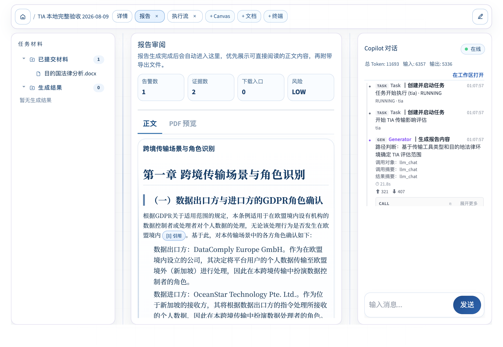
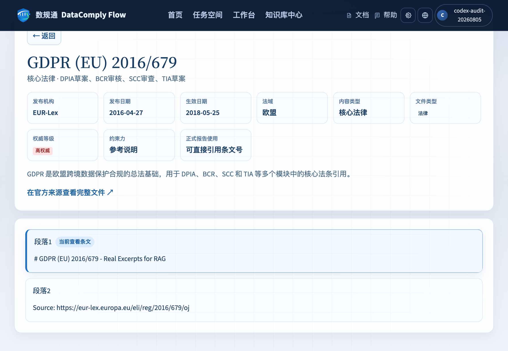
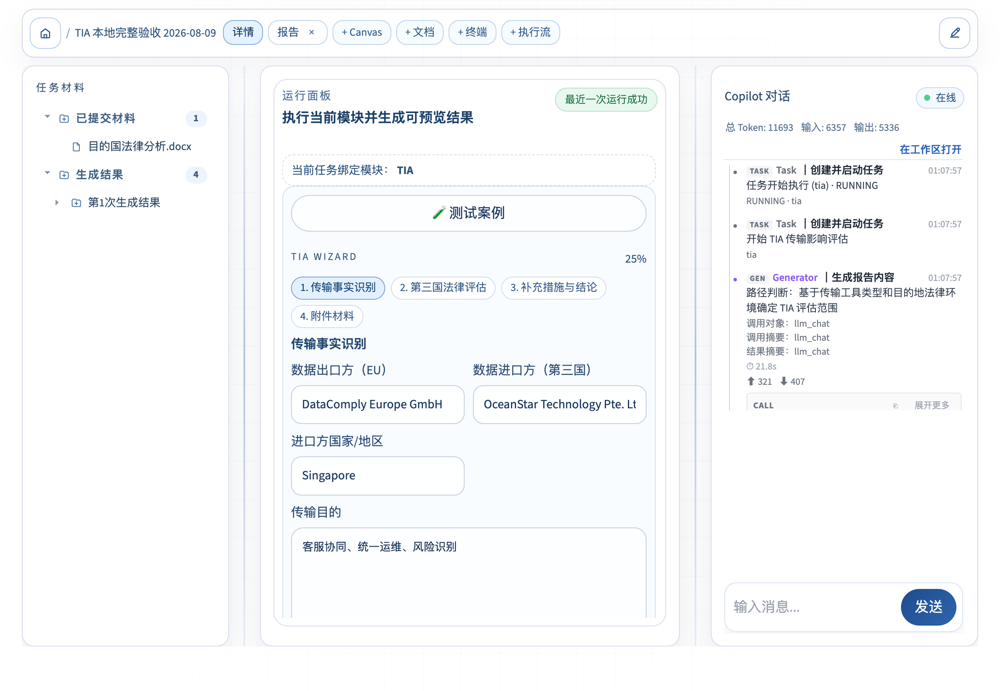
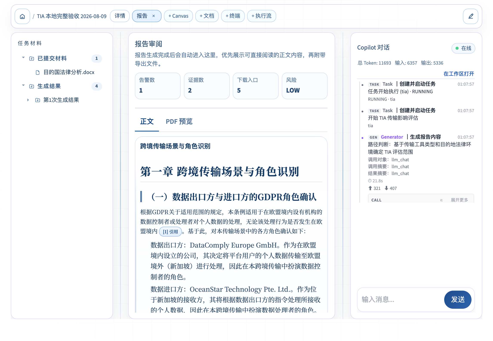
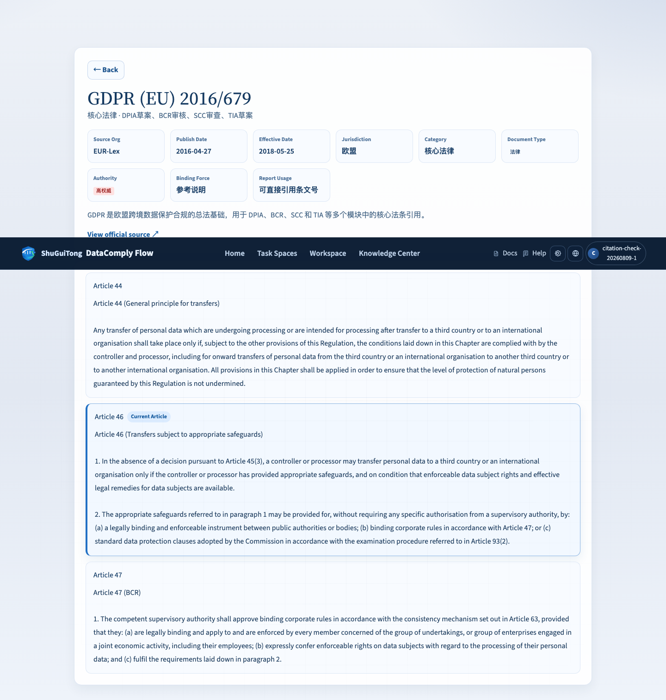

# DataComplyFlow TIA Schema-first 本地新旧流程首跑验收报告

> 日期：2026-08-08；2026-08-09 补验
> 范围：仅本地，不包含远端部署  
> 分支：`new`  
> 基准提交：`c775e5bfe4356f411a15b39735ce82071268f999`  
> 运行入口：`backend.domains.eu.tia.service.TIAService.generate_report`  
> 结论：**no-LLM 新旧流程通过；live provider 和浏览器执行闭环已补验；法规条文语义定位已在本地修复并通过 API、浏览器和回归测试，但 TIA 仍因 DPO 修复后尚未 live 重跑、Schema-first live 未启用而判定为部分完成。**

## 1. 结论说明

本轮用同一个仓库脱敏案例分别运行了旧流程和 Schema-first 新流程，两个流程都真实进入 `TIAService.generate_report`，并成功生成 MD、DOCX、PDF、ZIP 和 CitationMap。新流程额外生成 `document_ir.json`，Compiler 执行成功且诊断为空。

新旧流程生成的 MD、DOCX、PDF 文本内容一致，没有发现用户可见内容回归。新流程 ZIP 比旧流程多一个 `document_ir.json`，符合当前实现。

首轮 no-LLM 记录不能证明以下事项；2026-08-09 补验已补上 live provider、浏览器执行、产物展示、PDF 预览和技术层引用跳转证据，但没有改变报告质量结论：

- 不能证明真实附件解析正常。案例中的 `storage://uploads/scc_agreement.pdf` 是虚构 URI，仓库中没有对应文件；
- 首轮不能证明 live LLM 生成的正文引用正常；补验已看到正文脚注并能打开引用，但 `[1]` 实际定位到知识库“段落1”标题内容，不是报告声称的 GDPR 第46条；
- 首轮不能证明完整 token 统计链路正常；补验已记录 live provider token，但 Schema-first 开关仍为关闭；
- 首跑案例不能证明结构化 TIA 判断路径；第 14 节已用新增案例补验本地确定性规则；
- 不能证明 Compiler 失败后会自动切回旧流程。当前代码在 Compiler 失败时抛出异常，不会自动回退。

因此本报告的准确结论是：**Schema-first 开关、DocumentIR 生成、Compiler 成功门禁、旧输出兼容性、本地文件产出、结构化规则、本地 PDF 解析和法规条文语义定位已经通过；live 执行、浏览器展示和技术层跳转已通过；DPO 修复后的 live 结果和 Schema-first live 产物仍未通过。**

## 2. 代码执行路径

### 2.1 服务和渲染入口

#### 2.1.1 执行步骤

| 步骤 | 代码位置 | 本轮状态 |
|---:|---|---|
| 1 | `backend/core/settings.py:37`，`schema_first_tia_enabled` | 旧流程为 `false`，新流程为 `true` |
| 2 | `backend/domains/eu/tia/service.py:56`，`TIAService` | 两次均实例化并执行 |
| 3 | `backend/domains/eu/tia/service.py:78`，`generate_report` | 两次均完整返回 `TIAResult` |
| 4 | `backend/domains/eu/tia/service.py:228`，章节生成 | no-LLM 分支生成 6 个占位章节 |
| 5 | `backend/domains/eu/tia/service.py:290`，调用 `_render` | 两次均到达 |

#### 2.1.2 Schema-first 编译和产物

| 步骤 | 代码位置 | 本轮状态 |
|---:|---|---|
| 6 | `backend/domains/eu/tia/report_renderer.py:88`，Schema-first 分支 | 仅新流程执行 |
| 7 | `backend/domains/eu/tia/schema_first.py:52`，`build_tia_document_ir` | 仅新流程执行 |
| 8 | `backend/domains/eu/tia/report_renderer.py:100`，`DocumentCompiler.compile` | 新流程成功，无诊断 |
| 9 | `backend/domains/eu/tia/report_renderer.py:105`，用户文件渲染 | 两次均完成 |
| 10 | `backend/domains/eu/tia/report_renderer.py:148`，CitationMap 写盘 | 两次均完成 |

当前新流程的准确含义是：**先把章节转换为 DocumentIR 并通过 Compiler 校验，再沿用现有模板渲染 MD、DOCX、PDF。** 用户文件目前还不是直接从 DocumentIR 渲染出来的。

## 3. 输入真实性

本轮输入来自：

```text
backend/tests/tia/cases/01_minimal.json
SHA-256: 87f4a138f905a936dafc1926a0c068481ab18f5fe19c6fc8a40b8c87c6c8acb1
```

该案例是仓库维护的脱敏测试输入，内容为欧盟出口方向美国进口方传输 CRM 数据，使用 SCC，并声明政府访问风险和加密补充措施。

附件字段只包含以下元数据：

```text
file_name: scc_agreement.pdf
storage_uri: storage://uploads/scc_agreement.pdf
```

该 URI 没有对应真实文件。两次实际结果都记录：

```text
scc_agreement.pdf: [parse skipped] File not found: storage://uploads/scc_agreement.pdf
```

所以本报告只把它称为“脱敏请求 fixture”，不称为“真实附件案例”。

`resources/new` 中任务 6 的五份 DOCX 虽然是原始业务资料，但它们当前被 `scripts/build_seed_case_inputs.py` 标记为 `mapping_status=conflict`，且没有可直接映射到 `TIARequest` 的完整字段。本轮没有把它们冒充为可执行 TIA fixture。

## 4. 实际运行命令

可重复执行脚本：

```bash
./status/check/phase3_tia_firstrun_20260808/reproduce_no_llm_firstrun.sh
```

如需指定独立临时目录：

```bash
TIA_EVIDENCE_RUN_ROOT=/tmp/tia-local-check \
  ./status/check/phase3_tia_firstrun_20260808/reproduce_no_llm_firstrun.sh
```

脚本执行的关键环境变量如下：

```bash
AI4LAW_SCHEMA_FIRST_TIA_ENABLED=false  # 旧流程
AI4LAW_SCHEMA_FIRST_TIA_ENABLED=true   # 新流程
AI4LAW_LLM_PROVIDER=none
LC_ALL=en_US.UTF-8
LANG=en_US.UTF-8
```

脚本始终在 `/tmp` 下建立独立工作目录。TIA 自动生成的 RAG 索引、trace 和 `outputs/` 不会写入仓库运行目录。验收目录中的文件是运行成功后保存的结果副本。

之所以显式使用 `en_US.UTF-8`，是因为本机 `C.UTF-8` 组合会让 Python 在含中文的仓库路径上启动失败。该问题发生在 Python 加载 `site` 阶段，不是 TIA 业务故障。

## 5. 产物清单

### 5.1 旧流程

目录：`status/check/phase3_tia_firstrun_20260808/old/`

| 角色 | 是否生成 | 大小 |
|---|---:|---:|
| Markdown | 是 | 729 B |
| DOCX | 是 | 37,016 B |
| PDF | 是 | 3,535 B |
| ZIP | 是 | 38,018 B |
| CitationMap | 是 | 4,281 B |
| DocumentIR | 否 | 旧流程预期不生成 |
| 运行证据 | 是 | `run_evidence.json` |
| Trace | 是 | 7 个事件和 `manifest.json` |

### 5.2 新流程

目录：`status/check/phase3_tia_firstrun_20260808/new/`

| 角色 | 是否生成 | 大小 |
|---|---:|---:|
| Markdown | 是 | 729 B |
| DOCX | 是 | 37,016 B |
| PDF | 是 | 3,535 B |
| ZIP | 是 | 39,006 B |
| CitationMap | 是 | 4,281 B |
| DocumentIR | 是 | 3,684 B |
| 运行证据 | 是 | `run_evidence.json` |
| Trace | 是 | 7 个事件和 `manifest.json` |

每个 `run_evidence.json` 都记录了输入哈希、提交号、起止时间、耗时、输出角色、文件 SHA-256、ZIP 成员、CitationMap 统计、DocumentIR 统计和 trace 汇总。

## 6. 新旧结果对比

| 对比项 | 结果 | 说明 |
|---|---|---|
| Markdown 文本 | 一致 | 字符数均为 315，SHA-256 相同 |
| DOCX 可见文本 | 一致 | 抽取文本字符数均为 264 |
| DOCX 主文档 XML | 一致 | `word/document.xml` 内容一致 |
| PDF 可见文本 | 一致 | 均为 1 页，抽取文本字符数均为 317 |
| CitationMap 引用集合 | 一致 | 两次均为 2 个候选引用 |
| 风险等级 | 一致 | 两次均为 `LOW` |
| 章节数 | 一致 | 两次均为 6 |
| 新增内部产物 | 符合预期 | 新流程新增 `document_ir.json` |

DOCX 和 PDF 的整个文件 SHA-256 不作为新旧一致性的唯一判断依据。此类容器或渲染文件可能包含创建时间等元数据，即使可见内容一致，二进制哈希也可能不同。本轮同时核对了可见文本和 DOCX 主文档 XML。

## 7. DocumentIR 与 Compiler

新流程实际生成的 `document_ir.json`：

| 字段 | 实际值 |
|---|---:|
| `schema_version` | `3.0` |
| `report_type` | `tia` |
| section 数 | 6 |
| block 数 | 7 |
| claim block 数 | 0 |
| Compiler diagnostics | 0 |
| Compiler 结果 | success |

Compiler 在渲染用户文件前执行。若状态不是 `success`，`backend/domains/eu/tia/report_renderer.py:101-103` 会抛出 `ValueError` 并阻止输出。

本轮还执行了适配器和 Compiler 单元测试：

```bash
LC_ALL=en_US.UTF-8 LANG=en_US.UTF-8 \
  pytest -q backend/domains/eu/tia/tests/test_schema_first_adapter.py
```

实际结果：`7 passed in 0.27s`。测试覆盖 golden snapshot、`[N]` 脚注解析、marker 清理、新旧开关、DocumentIR 入 ZIP，以及未注册引用被 Compiler 阻止。

## 8. CitationMap 与 RAG

新旧两次的 CitationMap 统计一致：

| 指标 | 旧流程 | 新流程 |
|---|---:|---:|
| `all_items` | 2 | 2 |
| `footnote_map` | 0 | 0 |
| `CIT-EU-GDPR-ART1-P01` | 有 | 有 |
| `CIT-EU-EDPB-ART6-P01` | 有 | 有 |

这是修复前首跑留下的历史产物：当时法规索引把 GDPR Markdown 标题和正文错误地编成“段落1-4”，所以生成了 `CIT-EU-GDPR-ART1-P01`。2026-08-09 已修复入库器并单独重建 `EU-LAW-001`，当前索引定位符为 `35/44/46/47`；旧产物不回写，继续保留用于说明问题发生时的真实状态。no-LLM 分支在 `backend/domains/eu/tia/service.py` 直接生成占位章节，不会把引用 marker 写进正文，所以该次 `footnote_map=0`、DocumentIR 中 `claim_block_count=0`。

因此本轮只能证明：

- RAG 本地检索链路没有阻止服务完成；
- 检索结果中的 2 个候选依据进入 CitationMap；
- 旧、新流程的候选引用集合一致。

本轮不能证明：

- 这 2 个候选依据一定是当前案例最优依据；
- live LLM 正文一定正确引用它们；
- 正文脚注、CitationMap 和引用跳转三者已经形成完整闭环。

## 9. ZIP 内容

旧流程 ZIP 包含 3 个文件：MD、DOCX、PDF。

新流程 ZIP 包含 4 个文件：MD、DOCX、PDF、`document_ir.json`。

`citation_map.json` 当前在 ZIP 创建完成后才写盘，代码位置为 `backend/domains/eu/tia/report_renderer.py:137-154`，所以新旧 ZIP 都不包含 CitationMap。这是当前真实行为。

如果产品定义中的“完整输出包”要求 CitationMap 也在 ZIP 内，需要调整写盘顺序并补测试；本轮不把它误报为已完成。

## 10. Token、耗时和中间过程

| 指标 | 旧流程 | 新流程 |
|---|---:|---:|
| 完整运行耗时 | 1,772 ms | 1,852 ms |
| trace 事件 | 7 | 7 |
| LLM 调用 | 0 | 0 |
| prompt token | 0 | 0 |
| completion token | 0 | 0 |
| total token | 0 | 0 |
| `final` 事件 | 有 | 有 |
| `final_brief` 事件 | 有 | 有 |

这里的 token 为 0 是正确结果，因为运行脚本传入了 `DisabledLLM`。它证明 no-LLM 运行没有伪造 token，但不能证明 live provider 的完整 token 汇总正确。

本目录还保留了此前一次 live LLM 未完成运行：

```text
status/check/phase3_tia_firstrun_20260808/live_attempt/
```

该次运行完成 2 次 LLM 调用并记录 1,655 token，第三次调用开始后未完成，最终没有用户产物。它只作为失败现场保留，不能与本次 no-LLM 完整耗时或完整 token 混合统计。

## 11. 回退状态

旧流程仍然保留，且配置默认值仍为关闭 Schema-first：

```text
backend/core/settings.py:37
schema_first_tia_enabled: bool = False
```

这意味着出现风险时可以通过配置关闭新流程，然后重新执行任务。但是当前实现不是“同一次运行中 Compiler 失败后自动调用旧流程”：新流程 Compiler 失败会直接抛错。

本轮 `fallback_count=0` 表示 trace 中没有 LLM provider fallback 事件，不代表已经验证 Schema-first 自动回退。

## 12. 未完成项与风险

| 优先级 | 未完成项 | 原因 | 验收方式 |
|---|---|---|---|
| P0 | Schema-first live LLM 完整运行 | 当前成功 live 运行使用默认旧渲染流程 | 开启 TIA Schema-first 后完整生成产物，保留 token、耗时和 final 事件 |
| P0 | DPO 修复后 live 复验 | 旧浏览器任务生成于 DPO 问题传播修复之前 | 新任务最终简报必须显示 `needs_revision` 的关键问题，不得再写 `risks: []` |
| P1 | 真实业务附件 | 首跑 URI 是虚构的；补验仅使用 EDPB 官方 PDF | 增加脱敏 SCC/技术控制文件，验证证据字段进入报告 |
| P1 | 结构化输入路径 | 已补本地确定性测试 | `backend/tests/tia/cases/02_structured_local_attachment.json` + service 测试；live LLM 仍未覆盖 |
| P1 | CitationMap 入 ZIP | 当前代码未打包 | 明确产品契约；若要求打包，则改顺序并补 ZIP 成员测试 |
| P1 | Compiler 失败处置 | 当前只抛错 | 明确是阻断任务还是自动回旧流程，并补 service 集成测试 |
| P2 | 修复后任务的引用跳转 | 知识页和公共引用选择已验证，尚未重新消耗 provider 生成任务 | 新 live 任务生成 `ART46` 引用并点击进入 `?article=46` |

## 13. 验收汇总

| 验收项 | 结果 | 证据 |
|---|---|---|
| 同一脱敏输入运行旧流程 | 通过 | `old/run_evidence.json` |
| 同一脱敏输入运行新流程 | 通过 | `new/run_evidence.json` |
| MD/DOCX/PDF/ZIP | 通过 | `old/`、`new/` 产物 |
| CitationMap | 通过，但仅候选引用 | 两组 `citation_map.json` |
| DocumentIR | 通过 | `new/document_ir.json` |
| Compiler 成功门禁 | 通过 | 新流程 diagnostics 为空；适配器测试 7/7 |
| 新旧用户可见内容 | 通过 | MD、DOCX、PDF 语义一致 |
| no-LLM token/time | 通过 | 两组 `run_evidence.json` 和 trace manifest |
| live LLM token/time | 未通过 | `live_attempt/` 未完成运行 |
| 本地 PDF 解析 | 通过 | 第 14 节结构化案例读取 EDPB PDF |
| 真实业务附件解析 | 未通过 | 尚无脱敏 SCC/技术控制文件 |
| 结构化 TIA 路径 | 通过（确定性规则） | 第 14 节 service 测试 |
| 正文引用跳转闭环 | 通过（确定性路径） | 第 15 节三层同步测试；第 18 节语义定位测试和浏览器知识页 |
| 远端部署 | 未执行 | 本轮明确只在本地运行 |

## 14. 结构化输入和真实本地附件补验

新增固定案例：`backend/tests/tia/cases/02_structured_local_attachment.json`。

测试命令：

```bash
uv run pytest -q \
  backend/domains/eu/tia/tests/test_service.py::test_structured_service_parses_real_local_attachment \
  backend/domains/eu/tia/tests/test_schema_first_adapter.py
```

结果：`8 passed`。

该测试关闭外部 LLM、替换 RAG 查询为固定本地结果，只验证 service 的确定性部分：

- `route_decision` 已生成；
- `country_risk.country == "US"`；
- `measure_assessments` 非空；
- EDPB PDF 被 `FileParser` 成功读取；
- `attachment_notes` 没有 `parse skipped`。

这项补验把结构化输入和本地文件解析推进到“本地确定性逻辑已验证”。它仍不等于 live LLM 正文引用、完整 token 汇总或浏览器引用闭环验收。

## 15. 正文引用同步补验

新增 service 集成测试：

```text
backend/domains/eu/tia/tests/test_service.py::test_service_keeps_markdown_map_and_document_ir_citations_in_sync
```

测试使用固定本地 LLM 返回已注册的 `{{CIT-EU-GDPR-ART46-P01}}`，不访问外部 provider；其余路径使用真实 `TIAService`、CitationRegistry、Schema-first Compiler 和 renderer。

验证结果：

| 层 | 实际结果 |
|---|---|
| Markdown | 正文脚注集合为 `{"1"}` |
| CitationMap | `footnote_map` 编号集合为 `{"1"}` |
| DocumentIR | ClaimBlock 引用集合为 `{"CIT-EU-GDPR-ART46-P01"}` |
| Compiler | `success` |

定向回归命令：

```bash
uv run pytest -q \
  backend/domains/eu/tia/tests/test_service.py::test_structured_service_parses_real_local_attachment \
  backend/domains/eu/tia/tests/test_service.py::test_service_keeps_markdown_map_and_document_ir_citations_in_sync \
  backend/domains/eu/tia/tests/test_schema_first_adapter.py
```

结果：`9 passed`。

这证明固定、可重复的 service 路径中，正文编号、CitationMap 和 DocumentIR 能保持一致。由于使用固定本地 LLM，该证据仍不能替代 live provider 完整运行和浏览器点击跳转验收。

最终判定：**本地 no-LLM 新旧流程首跑通过，Schema-first TIA 的文件生成和 Compiler 接入成立；整体功能仍为“部分完成”，不得据此宣称真实附件、live LLM 引用或浏览器闭环已经验收。**

## 16. 2026-08-09 补验：live provider、浏览器和修复

### 16.1 CLI live provider

命令：

```bash
uv run python backend/tests/harness/runner.py tia 02_structured_local_attachment
```

结果为 `PASS`：16/16 断言通过，0 失败，0 跳过；耗时 `283660.7 ms`。运行目录为 `runs/tia/20260809_005823_443340_02_structured_local_attachment/`。

| 指标 | 实际值 |
|---|---:|
| Provider / model | SiliconFlow / DeepSeek-V3.2 |
| LLM 调用 | 9 |
| Trace 事件 | 25 |
| Prompt / completion / total token | 6,534 / 5,550 / 12,084 |
| Provider fallback / error | 0 / 0 |
| 产物 | MD、DOCX、PDF、ZIP、CitationMap |
| 本地附件 | EDPB 官方 PDF，解析成功 |

这证明 live provider、RAG 规划、附件审查、六章生成、DPO 复核和产物写盘实际执行。由于本地 `AI4LAW_SCHEMA_FIRST_TIA_ENABLED` 未开启，本次 live 结果没有 `document_ir.json`，这是当前默认关闭开关的预期行为，不是 renderer 测试失败。

### 16.2 浏览器异步执行

任务 ID：`e2bcc3159b33472aaddcc78542d386c5`；地址：`http://127.0.0.1:5173/workspace/task-1786208808600`。

| 项目 | 实际值 | 证据 |
|---|---:|---|
| API 提交 | 200 | `POST /api/v1/tia/generate_async` |
| 最终状态 | `COMPLETED` | 执行流最终事件 |
| 用时 | 292 秒 | `browser/03_tia_completed_with_tokens.png` |
| 事件 / 节点 | 28 / 15 | 同上 |
| Token | 11,693（输入 6,357，输出 5,336） | 同上 |
| Provider | SiliconFlow / DeepSeek-V3.2 | 执行流调用详情 |
| 产物 | MD、DOCX、PDF、ZIP、CitationMap | `browser/08_tia_report_outputs_and_pdf_enabled.png` |
| PDF 预览 | 成功加载 6 页 | `browser/09_tia_pdf_preview_loaded.png` |

浏览器上传的是开发预设 `目的国法律分析.docx`。执行流记录 `Transfer Agreement: No evidence extracted.`，所以这次浏览器运行证明上传、提交、实时事件和产物展示链路，不证明该预设文件含有可用于 TIA 判断的实质证据。

### 16.3 引用和知识库跳转

报告正文出现 `[1]`、`[2]`；CitationMap 请求返回 200：

```text
GET /api/v1/citations/reports/e2bcc3159b33472aaddcc78542d386c5?module=tia
```

两条引用均返回 `resolution_type=exact_article`、`can_jump=true`。点击 `[1]` 能打开引用抽屉，再点击“在知识库中继续阅读”进入：

```text
/knowledge/laws/EU-LAW-001?article=段落1
```






技术闭环通过，但法律语义验收不通过：`CIT-EU-GDPR-ART1-P01` 被映射为 `article_no=段落1`，打开内容是知识文件标题 `# GDPR (EU) 2016/679 - Real Excerpts for RAG`，不是报告声称的 GDPR 第46条。当前系统能跳到一个已入库对象，但不能证明跳到报告声称的具体条文。

该结论描述的是修复前任务的真实结果。第 18 节记录了后续本地修复和复验；旧任务的 CitationMap 不会被事后改写。

### 16.4 异步产物侧栏断链修复

浏览器首轮完成后曾出现左侧“生成结果 0”、报告页“下载入口 0”、PDF 页签禁用，而执行流已经给出 5 个输出文件。原因是 `WorkspaceShell` 只保存最终 `response`，没有把 `output_files` 转成工作区产物。

提交 `aecf75f` 已修复：

- `frontend/src/lib/workspace.ts` 增加 `extractRunResponseState()`，统一提取产物、证据和问题；
- 同步运行、异步完成和刷新恢复共用同一提取路径；
- 按路径、证据内容和问题文本去重，避免刷新后重复显示。

回归结果：前端全量测试 `128 passed / 2 skipped`，`npm run build` 通过。修复后的浏览器证据：





### 16.5 DPO 质量门禁

live 浏览器执行流中的 DPO 复核返回 `review_result=needs_revision`，关键问题为：

1. 数据敏感性仍为 `unknown`，无法完成比例性和适当保障评估；
2. 补充措施充分性仍为 `unknown`，需要基于 EDPB Recommendations 01/2020 给出有证据的确定结论。

但旧任务最终事件仍写成 `risks: []`，报告页显示 `风险 LOW`。这不是程序没有跑完，而是质量门禁结果没有进入 `TIAResult.consistency_issues` 和最终简报。

已用 `backend/domains/eu/tia/tests/test_service.py::test_dpo_revision_issues_are_exposed_to_callers` 固定修复边界：规则问题先传给 DPO，DPO `critical_issues` 以 `[DPO复核] ...` 合并进 `consistency_issues`；`needs_revision/rejected` 时最终简报下一步改为修复和重新审阅。TIA 测试集结果：`19 passed`。

本次浏览器任务在该后端修复前运行，因此旧任务截图仍显示旧的 `risks: []`；不能把旧截图当作修复后的浏览器证据。重新跑 live provider 需要再次消耗模型调用，暂不重复消耗，先以服务测试作为修复证据。

## 17. 补验汇总

| 验收项 | 当前结论 | 依据 |
|---|---|---|
| no-LLM 新旧流程 | 通过 | `old/`、`new/` 运行证据 |
| live provider CLI | 通过（执行层） | 9 calls、12,084 tokens、16/16 checks |
| 浏览器提交和中间过程 | 通过（执行层） | 200、28 events、292s、tokens |
| MD/DOCX/PDF/ZIP 写盘 | 通过 | CLI 和浏览器输出清单 |
| PDF 预览 | 通过 | 6 页 iframe，截图 09 |
| CitationMap 接口 | 通过（技术层） | 200，2 条 footnote |
| 引用抽屉和知识库跳转 | 通过（技术层） | 截图 05、06 |
| 法规条文语义定位 | **本地修复通过** | 第 18 节：API、公共引用测试、知识页 `?article=46` 和截图 10 |
| Schema-first live 产物 | 未验收 | 本地开关仍关闭；仅 no-LLM 新流程通过 |
| DPO 质量门禁 | **不通过** | live 返回 `needs_revision`，关键缺口未解决 |
| 异步产物侧栏断链 | 已修复 | 提交 `aecf75f`，截图 07、08，前端 128/2 |
| 远端部署 | 未执行 | 本地限制仍有效 |

最终结论：**TIA 的本地执行链路和法规条文语义定位已跑通，但还不是可交付的合规报告。下一步用修复后的 DPO 状态和 Schema-first 开关重跑 live 浏览器任务；这两项完成前，不进入远端部署。**

## 18. 2026-08-09 补验：GDPR 第 44/46 条语义定位修复

### 18.1 根因和修复边界

| 问题 | 根因 | 修复 |
|---|---|---|
| 英文条号变成“段落1-4” | `scripts/build_regulation_articles.py` 只识别中文“第X条” | 增加仅匹配行首/Markdown 标题的英文 `Article N` 解析，避免把正文内提及误当标题 |
| 为修一条法规可能重写全索引 | 脚本只有全量覆盖模式 | 增加 `--source-id`，在原位置替换指定来源，其他行原样保留 |
| GDPR 标题匹配掩盖条号不匹配 | `_stage1_source_match()` 先给标题分，错误候选仍能超过门槛 | 对 TIA/SCC 中标题已明确匹配的欧盟权威源，同时核对指定条文；明确冲突的候选不进入 CitationMap，不限制其他来源的内容相关性匹配 |
| GDPR 来源缺少 TIA 条文 | `EU-LAW-001` 只有第 35、47 条摘要 | 从仓库已有 EUR-Lex 官方来源材料补入第 44、46 条，并保留第 35、47 条 |

单来源重建命令：

```bash
uv run python scripts/build_regulation_articles.py --source-id EU-LAW-001
```

结果：只替换 `regulation_articles.jsonl` 中 4 行，索引总行数仍为 3,030；`EU-LAW-001` 的定位符从 `段落1/2/3/4` 变为 `35/44/46/47`。

### 18.2 自动化与 API 证据

```bash
uv run pytest -q \
  scripts/tests/test_build_regulation_articles.py \
  backend/common/citation/tests/test_module_grounding.py \
  backend/domains/eu/tia/tests \
  backend/services/tests/test_knowledge_index.py \
  backend/api/v1/tests/test_knowledge.py
```

结果：`32 passed`。覆盖英文标题解析、单来源替换不改无关行、错条文拒绝、TIA 引用 `CIT-EU-GDPR-ART46-P01`、知识索引唯一性和知识 API。

本地 API 实测：

```text
GET /api/v1/knowledge/sources/EU-LAW-001/articles/46
status: 200
article_no: 46
article_content: Article 46 (Transfers subject to appropriate safeguards) ...
```

Ruff 对本次 Python 文件检查结果：`All checks passed!`。

### 18.3 浏览器证据

使用本地测试账号登录后访问：

```text
http://127.0.0.1:5173/knowledge/laws/EU-LAW-001?article=46
```

实际观察：URL 保留 `article=46`；页面标记 `Article 46 / Current Article`；正文包含 `appropriate safeguards`；页面不包含“段落1”；浏览器 console error/warning 为 0。



这项证据证明公共知识页和引用选择逻辑已经修复。它不等于修复后的完整 live TIA 任务已经重跑；旧任务仍保留旧 CitationMap，下一次 live 任务必须生成 `ART46` 并再次点击验收。
